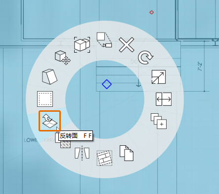

# 1.2 - Project Set Up with Images and Grid

_You can import PNG or JPG images onto the ground plane of the model by selecting File &gt; Import from the Navigation Bar. However, to gain more control over the scale and position of an imported image, we can create a custom material and apply it to a rectangle that we have drawn ourselves._

_If you did not complete the last section, download and open the_ _**1.2 - Project Set Up with Images and Grid.axm**_ _file from the_ _**FormIt Primer Part 1 Datasets**._

## **Calculate Image Size**

The provided **plan.png** is an image of a plan printed on a 24” x 26” Sheet \(ARCH D\) which is 3600 pixels wide by 2400 pixels high. By knowing the drawing scale \(¼"=1'-0"\) and the image dimensions you can calculate that 1’ = 25 pixels, which means that the image should be 144'x96' when imported into FormIt at full scale.

## **Import an Image to scale**

1 – Click the **Top View** icon from the **Floating Navigation Bar** to see the scene from above.

2 - Choose the **Rectangle Tool \(R\)** from the 3D Sketch toolbar.

3 – To create a rectangle that is exactly **144’** x **96’**, click anywhere in the workspace to define the starting point, then move the mouse to preview and define the first side length. Start typing a dimension value to access a dialog where you can input the exact dimension. Click **OK** or press the **Enter** key to commit the dimension. Repeat the process to set the second side’s length and finish the rectangle.

4 - To create the new “Floor Plan” material:

1. Open the **Material Palette**.
2. Click the **+** icon to create a new material.
3. Name the new material “**Floor Plan”.**
4. Under **MAPS** click on the **Texture** preview tile and browse to **plan.png** in the **Farnsworth House Data Set &gt;  Supporting Files &gt; Images** folder. Then click **Open**.
5. Under **PROPERTIES**, change the image’s scale by entering **144'** in the **Horizontal Scale** field and **96'** in the **Vertical Scale** field. Note that unlocking horizontal and vertical scale \(**chain link** icon\) may be required to insert values that change the image proportions.
6. Check **Transparency** and set it at around half. This will help align the imported floor plan image to the satellite image.
7. Click **OK** to finish the material.

5 - To paint the rectangle:

1. In the **Material Palette**, single-click on the **Floor Plan material** tile to paint with this material.
2. Click on the rectangle you sketched to paint it. Press **Esc** to exit the paintbrush tool.

6 - If the material appears inverted or backward, you may need to reverse the face. You can do so by right-clicking with the mouse to access the **Context Menu** and selecting the Reverse Face \(FF\) button.

## **Align the Imported Image to the Satellite Image**

1 – To move the image, first select the rectangle by double-clicking on it. Then click-and-drag the rectangle and move it until it overlaps the building in the Satellite image. We will come back to aligning it perfectly later, just try to get it close for now.

2 - To rotate the rectangle to align with the Satellite image:

1. Right-click on the rectangle to bring up the context menu. Choose **Rotate \(Q\).**
2. The **Rotate Widget** appears in the middle of the rectangle. Select the widget by clicking once on the orange grip in the middle. Move the widget to the bottom left corner of the rectangle. It will snap to the corner. Click to place it.
3. Type **9**, and the dimension box will appear. Click **OK** to rotate the rectangle counterclockwise by 9 degrees.

## **Align the Grid to the Satellite Image**

1 - Now, we will align the grid with the Satellite image and the floor plan. Right-click anywhere on the **ground plane** and choose **Set Axes \(SZ\)**.

2 – The **Set Axis** widget will appear. Move the axis to the bottom left corner of the rectangle, where it should snap. Click to place it.

3 - Click on the grip at the end of the red axis. Move the grip to the bottom right corner of the rectangle so that the red axis aligns with the bottom edge of the plane. Click off in space to commit this change.

4 - To align the view with the new grid, click the Top View icon from the Navigation Bar to reset the scene.

5 - To ensure the building in both images overlap, select the plan to move it once more until it overlaps the Satellite image correctly.

6 - The satellite image, the rectangle, and the grid are now aligned, which will simplify 3D sketching.

