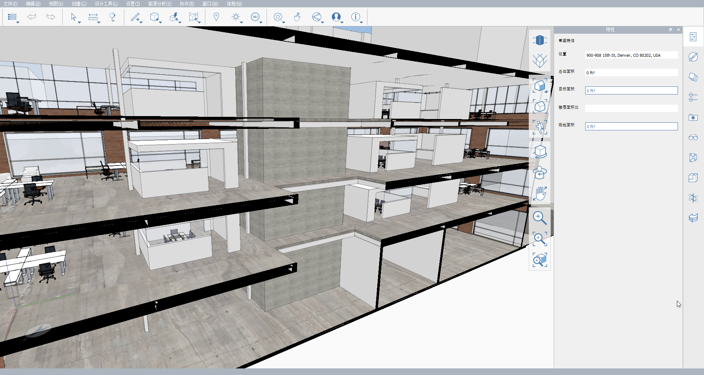

# 2.1 - オフセット ライン ツール

_**オフセット ライン\(OL\)**_ _を使用すると、定義した厚さで線分を描画できます。オフセット幅と位置合わせ方向を設定すると、このツールで、平面図のトレース、壁の作成、道路の描画など、設定した厚さの直線ベースのシェイプを簡単な方法ですばやく作成できます。_

_この演習では、_ _**Encode Campus Sample Model.axm**に室内の間仕切りを追加します。まだダウンロードしていない場合は、_ _**FormIt Primer Part 2 Dataset**からファイルをダウンロードできます。_

## 壁を描画する

_まず、_ _**[オフセット ライン\(OL\)]**_ _ツールを使用して、2 階のオフィス スペースに壁をいくつか描画します。_

1 - _**Encode Campus Sample Model.axm**_ を開いた後、現在のビューの向きを平面図ビューにします。**[シーン]パレット**で、**Plan – 2nd Floor Office** という名前のシーンをダブルクリックします。

_**注:**_ _シーンを使用してカメラ位置と断面レイヤの表示の両方をコントロールすると、モデルを効率的にナビゲートできます。断面の詳細については、_ _**FormIt Primer Part 1**_ _の「**断面平面**_」の章を参照してください。

2 _**-**_ 小さな会議室となる最初の壁から始めます。

1. **標準ツールバー**から**[スケッチを作成]**ボタン\(鉛筆のアイコン\)をクリックし、**[オフセット ライン\(OL\)]**ツールを選択します。
2. シャフトの左下コーナーをシングルクリックして、壁の描画を開始します。
3. 緑色の **X 軸**に沿ってマウスを左にドラッグし、**[Tab]**キーを押すか、寸法の入力を開始します。
4. **[ツール オプション]**ダイアログが表示されます。ここでは、オフセット ラインの長さだけでなく、**[厚さ]**と**[位置合わせ]**も設定できます。**[寸法]**に **22'** と入力し、**[厚さ]**に **6"** と入力します。**[位置合わせ]**で、ドロップダウンから**[左]**または**[右]**を選択します。これにより、下の図に示すように、オフセット ラインの下部エッジがシャフト壁と同一平面上に配置されます。**[OK] をクリックします。**

_**注**_ _:_ _**[ツール オプション]**_ _ダイアログで_ _**[寸法]**を入力せずに既定の_ _**[厚さ]**_ _や_ _**[位置合わせ]**_ _を修正することもできます。その場合は、_ _**[寸法]**_ _フィールドの値を消去してから_ _**[OK]**をクリックします。モデルでは_ _**[オフセット ライン\(OL\)]**_ _ツールがアクティブな状態のままであるため、オフセット ラインの次の終点となる場所をモデル上でクリックして定義します。_

3 - 会議室の残りの壁を描画します。

1. **[オフセット ライン\(OL\)]**ツールを終了せずに、下の図に示した寸法に一致するシェイプを描画します。各セグメントを作成するには、**[Tab]**キーを使用するかそのまま入力を開始して、各エッジの希望の長さを入力します。
2. **[左]**および**[右]**のオフセットの方向は、描画しているポリラインの方向に基づくため、シェイプ全体を描画する間に反転する場合があります。反転した場合は、**[Tab]**を押して、必要に応じて**[位置合わせ]**ドロップダウンの**[左]**と**[右]**を切り替えます。
3. [オフセット ライン]コマンドを完了するには、最後の終点の位置をダブルクリックします。この終点は、最初に描画した線分と交差する必要があります。ダブルクリックすると描画したオフセット ラインが消えてしまう場合は、次の手順で見つけることができます。

_**注**_ _:_ _**[正投影\(VO\)]**_ _と_ _**[パース投影\(VP\)]**_ _のカメラ モードをいつでも切り替えて、簡単に描画できます。ただし、カメラに対して垂直な要素の中には、[正投影]モードで表示されないものもあります。_

_**注**_ _:_ _**[オフセット ライン\(OL\)]**_ _ツールを使用する場合、重なり合ったパスや交差するパスを作成しても問題ありません。コマンドが終了するとすぐに、すべての線分が 1 つのクリーンなサーフェスに結合され、内側の余分なエッジが削除されます。_

4 - 作成したオフセット ラインが表示されない場合は、作成した新しいサーフェスがオフィスの床とまったく同じ平面にあることが原因です。ビューを少しオービットして、描画したオフセット ラインが床のサーフェスと干渉していることを確認します。面の任意の場所をシングルクリックして選択します。

_**注:**_ _この新しいサーフェスを選択できない場合は、[Spacebar]を使用して選択オプション間を移動するか、レイヤ_ _**Encode Main Building - Floors**_ _を一時的にオフにします。_

5 - シェイプを垂直に **8'-0"** 押し出して壁を作成します。

6 - 描画と押し出しでこのオフィスの床に自由に壁を追加して、**[オフセット ライン\(OL\)]**ツールに慣れてください。上記のように、シーン **Plan – Second Floor Office** と 3D ビューの切り替えが必要となる場合があります。慣れたら、以降のセクションで紹介するこのツールの創造的な使用方法を確認してください。

## ドアを作成する

_[_ _**オフセット ライン**_ _**\(OL\)]**_ _ツールは、平面図以外でも使用できます。次に、このツールを使用して簡単な出入口を作成します。_

1 - 最初に 3D ビューを下の図のように配置し、描画した最も長い壁がシャフトの外側のコーナーと接する場所を確認できるようにします。問題が発生した場合は、前に使用したシーン **Plan – Second Floor Office** から開始するか、レイヤ **Section – 2nd Floor Office Plan** がオンのままになっていることを確認してください。

2 - 多くの場合、出入口は側枠ではなく中心線を基準にして配置されます。**[オフセット ライン\(OL\)]**ツールを使用し、中心点でドアの開口部を作成します。

1. まず、出入り口の中心点をマークします。**[線分\(L\)]**ツールを使用して、図に示すように、シャフトの下のコーナーから新しい壁の下部エッジに沿って **3'** の線分を描画します。
2. **[オフセット ライン\(OL\)]**ツールを再度起動します。
3. 先ほど描画した線分の端点をクリックして、ドアの描画を開始します。これにより、出入口の中心がシャフトの壁から **3'** になります。
4. 青色の **Z 軸**に沿ってマウスを上にドラッグし、**[Tab]**キーを押します。**[寸法]**に **7'**、**[厚さ]**に **4'** と入力し、**[位置合わせ]**を**[中心]**に設定します。**[OK]**をクリックすると設定した内容のセグメントが作成されます。**[Esc]**を押して、**[オフセット ライン]**を終了します。

_**注:**_ _この単一セグメントのオフセット ラインを壁と同一平面に配置できない場合は、現在の軸が原因である可能性があります。_ _**[軸を設定\(SZ\)]**_ _ツールを使用して、シーン_ _**Plan – 2nd Floor Office**_ _を基準に軸の方向をリセットすると、緑色の **X 軸**が左を指し、赤色の **Y 軸**が上を指すようになります。_

3 - 出入口の輪郭を開口部に変更するには、先ほど作成した面をシングルクリックし、壁を通って消えるまでドラッグします。

## 自由に創作する

1 - 次に、[オフセット ライン]のみを使用して、会議室への入口とスイープ窓を追加します。

1. **[オフセット ライン\(OL\)]**ツールを再度開始し、同じ壁の下端に沿って、シャフトのコーナーから左側に約 **10**' の位置で始点を選択します。
2. 青色の **Z 軸**に沿ってマウスを上方向にドラッグし、**[Tab]**を押します。
3. この最初の線分は別の出入口になります。**[寸法]**に **5'-6"** と入力します。今回は**[厚さ]**を **3'** に設定し、**[位置合わせ]**が**[中心]**に設定されていることを確認します。確認後、**[OK]**をクリックします。
4. 窓用の水平ストリップを作成するには、緑色の **X 軸**に沿って会議室のシャフトから遠いコーナーにカーソルをドラッグします。
5. **[Shift]**を押しながら緑色の **X 軸**にロックし、壁の外側コーナーに沿った任意の場所をクリックします。**[Esc]**を押して、[オフセット ライン]を終了します。

2 - 仕上げとして、先ほど作成したシェイプで会議室の壁を切り取り、ガラスを追加します。先ほど作成した L 字型サーフェスをシングルクリックして選択します。次に、会議室の最も離れた壁を通り過ぎるまで後方にドラッグして、3 つの壁を同時に切り取ります。

3 - 次に、ガラスを追加します。

1. **[線分]**ツールを使用して、図に示すように合計 4 つの垂直な線分(開いたコーナーにそれぞれ 1 本、新しい出入口の開口部のエッジにそれぞれ 1 本)を作成します。この操作で、FormIt では 3 つの新しいサーフェスが作成されます。
2. **[マテリアル]パレット**からマテリアル **Glass - New** を選択して、これら 3 つのサーフェスをペイントします。
3. 常にモデルを整理することをお勧めします。作成したすべてのジオメトリ(ガラスと壁)を 1 つのグループにまとめます。「**Conference Room**」という名前を付け、レイヤ **Encode Main Building – Interior Partitions** に配置します。

4 - 最後の手順はユーザ次第です。創造力を発揮し、FormIt を使用してこのプロジェクトを自由に変更してみてください。下図では、会議室に家具と天井を追加し、会議室グループのコピーをシャフトの反対側にミラーし、別の「ポッド」エリアを追加し、床にオフィス家具を配置しました。次に、そのジオメトリをオフィス階すべてに配列しました。

