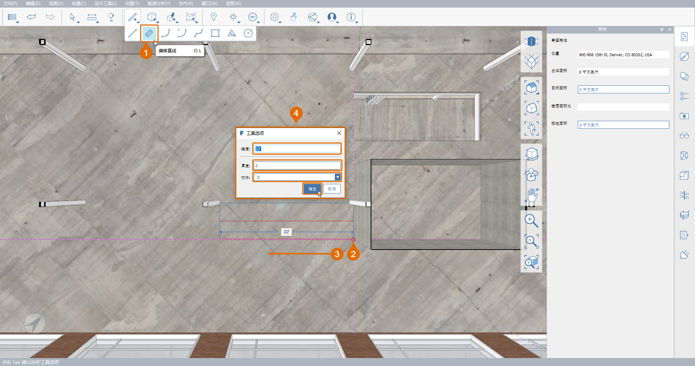

# 2.1. Инструмент «Линия со смещением»

_Инструмент_ _**Линия со смещением \(OL\)**_ _позволяет рисовать линии с заданной толщиной. Можно задать ширину смещения и направление выравнивания, что упрощает трассировку планов, создание стен, рисование дорог и позволяет быстрее создавать любые другие линейные формы с заданной толщиной._

_В этом упражнении выполняется добавление нескольких внутренних перегородок в файл_ _**Encode Campus Sample Model.axm**. Если вы еще этого не сделали, данный файл можно скачать из_ _**набора данных для части II руководства FormIt Primer**._

## Рисование стен

_Сначала нарисуйте несколько стен в офисном пространстве на 2-м этаже, воспользовавшись для этого инструментом_ _**Линия со смещением \(OL\)**_ _._

1 – После открытия файла _**Encode Campus Sample Model.axm**_ переместите текущий вид на вид в плане. На **палитре «Сцены»** дважды щелкните сцену с именем **Plan — 2nd Floor Office**.

_**Примечание.**_ _Управление положением камеры и видимостью слоев сечения с помощью сцен — эффективный способ навигации по модели. Дополнительную информацию о сечениях см. в главе_ _**Секущие плоскости**_ _**части I руководства FormIt Primer.**_

2 _**-**_ Чтобы начать построение первой стены небольшого конференц-зала выполните следующие действия.

1. На **панели инструментов «Стандартная»** нажмите кнопку **Создать эскиз** \(значок карандаша\) и выберите инструмент **Линия со смещением \(OL\)**.
2. Чтобы начать рисование стен, щелкните в нижнем левом углу шахты.
3. Начните перетаскивать мышь влево по зеленой оси \(**X**\), затем нажмите клавишу **TAB** или начните ввод размера.
4. Появится диалоговое окно **Параметры инструмента**, где можно задать не только длину линии со смещением, но также параметры **Толщина** и **Выравнивание** для нее. В поле **Размер** введите значение **22 фута**. В поле **Толщина** введите значение **6 дюймов**. Для параметра **Выравнивание** выберите в раскрывающемся списке значение **По левому краю** или **По правому краю**, чтобы нижний край линии со смещением был на одном уровне со стеной шахты, как показано на изображении ниже. Нажмите кнопку **ОК**

_**Примечание.**_ _Если необходимо изменить значения параметров_ _**Толщина**_ _и/или_ _**Размер** по умолчанию без ввода значения_ _**Размер**_ _в диалоговом окне_ _**Параметры инструмента**_, _удалите значение из поля_ _**Размер**_ _перед нажатием кнопки_ _**ОК**. Будет выполнен возврат в модель. При этом_ _**инструмент смещения \(OL\)**_ _будет по-прежнему активен. Теперь можно щелкнуть модель, чтобы задать следующую конечную точку линии со смещением._

3 - Нарисуйте остальные стены конференц-зала.

1. Не выходя из инструмента **Линия со смещением \(OL\)**, нарисуйте форму, соответствующую размерам, показанным на изображении ниже. Для создания сегментов используйте клавишу **TAB** или просто введите требуемую длину каждого ребра.
2. Направление смещения **Влево**/**Вправо** определяется направлением создаваемой полилинии, поэтому может меняться в процессе рисования всей формы. Если это происходит, нажмите клавишу **TAB** и в раскрывающемся списке **Выравнивание** выберите требуемое значение **По левому краю** или **По левому краю**.
3. Для завершения работы с командой «Линия со смещением» дважды щелкните в местоположении конечной точки, которая должна пересекаться с первой линией, нарисованной ранее. Нарисованные линии со смещением могут исчезнуть при двойном нажатии, но они снова появятся при выполнении следующего шага.

_**Примечание.**_ _Для упрощения процесса рисования можно переключаться между режимами камеры_ _**Ортогональный \(VO\)**_ _и_ _**Перспективный \(VP\)**_ _. Однако некоторые элементы, перпендикулярные камере, могут быть невидимы, если включен ортогональный режим._

_**Примечание.**_ _При использовании инструмента_ _**Линия со смещением \(OL\)**_ _могут быть созданы перекрывающие друг друга или пересекающиеся траектории. После завершения работы с командой все линии будут объединены в одну «чистую» поверхность, а все дополнительные внутренние ребра будут удалены._

4 - Если только что созданная линия со смещением не отображается, это происходит потому, что новая поверхность находится в той же плоскости, что и пол офиса. Поверните вид немного, пока нарисованные линии со смещением не встретятся с поверхностью пола. Чтобы выбрать поверхность, щелкните в любом месте на грани.

_**Примечание.**_ _Если не удается выбрать новую поверхность, используйте пробел для переключения параметров выбора или временно отключите слой_ _**Encode Main Building — Floors**_ _._

5 - Выдавите форму **8 футов 0 дюймов** по вертикали, чтобы создать стены.

6. Добавьте другие стены на офисный этаж путем их рисования и выдавливания, чтобы лучше ознакомиться с инструментом **Линия со смещением \(OL\)**. Возможно, потребуется переключиться между сценой **Plan — Second Floor Office** и 3D-видом, как было описано выше. В следующих разделах описаны другие возможности использования этого инструмента.

## Создание дверей

_Инструмент_ _**Линия со смещением**_ _**\(OL\)**_ _необязательно использовать исключительно на плане. Ниже описано, как с помощью него быстро создать дверной проем._

1 - Разместите 3D-вид таким образом, чтобы можно было видеть, где самая длинная нарисованная стена пересекается с наружным углом шахты, как показано на изображении ниже. Если возникли проблемы, начните с уже использованной сцены **Plan — Second Floor Office** или убедитесь, что слой **Section — 2nd Floor Office Plan** все еще включен.

2 - Часто дверные проемы размещаются на основе осевой линии, а не косяков. Используйте инструмент **Линия со смещением \(OL\)**, чтобы создать дверной проем по его центральной точке.

1. Сначала пометьте центральную точку дверных проемов. С помощью инструмента **Линия \(L\)** нарисуйте линию длиной **3 фута** от нижнего угла шахты вдоль нижнего ребра новой стены, как показано на изображении.
2. Запустите инструмент **Линия со смещением \(OL\)** еще раз.
3. Чтобы начать рисование двери, щелкните конечную точку только что нарисованной линии. При этом центр дверного проема будет находиться на расстоянии **3 футов** от стены шахты.
4. Перетащите мышь вверх по синей оси \(**Z**\) и нажмите клавишу **TAB**. Для параметра **Размер** укажите значение **7 футов**, для параметра **Толщина** — **4 фута**, а для параметра **Выравнивание** — **По центру**. Нажмите кнопку **ОК**, чтобы создать сегмент. Нажмите клавишу **ESC**, чтобы завершить работу с командой **Линия со смещением**.

_**Примечание.**_ _Если невозможно разместить линию со смещением в виде одного сегмента на одной плоскости со стеной, вероятно, причиной является текущая ось. Используйте инструмент_ _**Задать оси \(SZ\)**_ _для сброса направления осей относительно сцены_ _**Plan — 2nd Floor Office**_ _, чтобы зеленая ось \(**X**\) указывала влево, а красная \(**Y**\) — вверх._

3 - Чтобы превратить контур дверного проема в проем, щелкните только что созданную грань и перетащите ее обратно через стену, пока она не исчезнет.

## Творческий подход

1 - Теперь добавьте несколько входов в конференц-зал и раздвижное окно, используя только одну линию смещения.

1. Снова запустите инструмент **Линия со смещением \(OL\)** и выберите начальную точку в основании той же стены примерно на **10 футов** влево от угла шахты.
2. Перетащите мышь вверх по синей оси \(**Z**\) еще раз и нажмите клавишу **TAB**.
3. Первая линия будет еще одним дверным проемом. Снова введите для параметра **Размер** значение **5 футов 6 дюймов**. На этот раз для параметра **Толщина** укажите значение **3 фута** и убедитесь, что для параметра **Выравнивание** по-прежнему задано значение **По центру**. Нажмите кнопку **ОК**
4. Чтобы создать горизонтальную полосу для окна, перетащите указатель вдоль зеленой оси \(**X**\) в дальний угол конференц-зала.
5. Удерживайте клавишу **SHIFT** для привязки к зеленой оси \(**X**\), а затем щелкните в любом месте наружного угла стены. Нажмите клавишу **ESC**, чтобы завершить работу с командой «Линия со смещением».

2 - В завершение рассеките стены конференц-зала с помощью только что созданной формы, а затем добавьте стеклянные элементы. Выберите только что созданную L-образную поверхность, щелкнув по ней мышью. Перетащите ее назад за самую удаленную стену конференц-зала, чтобы она пересекала сразу три стены.

3 - Добавьте стеклянные панели.

1. С помощью инструмента **Линия** создайте в общей сложности 4 \(четыре\) вертикальные линии, как показано на изображении: по одной на каждом из открытых углов и по одной на ребре каждого нового дверного проема. При этом FormIt создаст 3 \(три\) новые поверхности.
2. Окрасьте эти 3 \(три\) поверхности с помощью материала **Glass — New**, который можно найти на **палитре материалов**.
3. Не забывайте упорядочивать элементы модели, так как это помогает в работе. Сгруппируйте всю только что созданную геометрию \(стеклянные панели и стены\) в один набор. Присвойте ей имя **Конференц-зал** и поместите ее на слой **Encode Main Building — Floors**.

4 - Последний шаг за вами! Проявите свой творческий потенциал, дополнив этот проект собственными идеями с помощью FormIt. На изображении ниже мы добавили в конференц-зал мебель и потолок, создали зеркальную копию группы конференц-залов на противоположной стороне шахты, добавили еще одну область-модуль и разместили на этаже офисную мебель. Затем мы размножили геометрию, разместив ее в виде массива на других офисных этажах.

