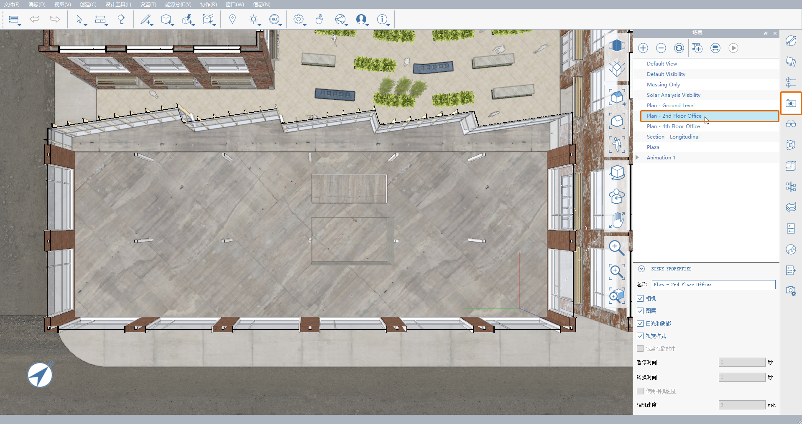

# 2.1 - Strumento Linea di offset

_**Linea di offset \(OL\)**_ _consente di disegnare linee con uno spessore definito. È possibile impostare la direzione di giustificazione e la larghezza dell'offset, rendendo questo strumento un modo semplice per tracciare piante, creare muri, disegnare strade o generare rapidamente qualsiasi altra forma lineare con uno spessore impostato._

_In questo esercizio, aggiungeremo alcune partizioni interne al file_ _**Encode Campus Sample Model.axm**. Se non è già stato fatto, è possibile scaricare il file dal_ _**set di dati della Parte II della Guida introduttiva di FormIt**._

## Disegno di muri

_Innanzitutto, disegneremo alcuni muri nello spazio dell'ufficio del secondo piano utilizzando lo strumento_ _**Linea di offset \(OL\)**_ _._

1 - Dopo l'apertura di _**Encode Campus Sample Model.axm**,_ orientiamo la vista corrente in una vista di pianta. Nella **tavolozza Scene**, fare doppio clic sulla scena denominata **Plan – 2nd Floor Office**.

_**Nota**_ _L'utilizzo delle scene per controllare sia la posizione della cinepresa che la visibilità dei layer di sezione è un modo efficiente per navigare nel modello. Per ulteriori informazioni sulle sezioni, consultare il capitolo_ _**Piani di sezione**_ _della **Parte I della Guida introduttiva di FormIt.**_

2 _**-**_ Per iniziare il primo muro di quella cha sarà una piccola sala conferenze:

1. Sulla **barra degli strumenti Standard**, fare clic sul pulsante **Crea disegno** \(icona a forma di matita\) e selezionare lo strumento **Linea di offset \(OL\)**.
2. Per iniziare a disegnare i muri, fare clic una sola volta sull'angolo inferiore sinistro del pozzo.
3. Iniziare a trascinare il mouse verso sinistra lungo l'asse verde \(**Asse X**\), quindi premere il tasto **TAB** o iniziare a digitare una quota.
4. Viene visualizzata la finestra di dialogo **Opzioni strumento**, dove è possibile impostare non solo la lunghezza della linea di offset, ma anche **Spessore** e **Allineamento**. Per **Quota**, digitare **22'**. Per **Spessore**, digitare **6"**. Per **Allineamento**, selezionare **Sinistra** o **Destra** dall'elenco a discesa, in modo che il bordo inferiore della linea di offset sia allineato con il muro del pozzo, come mostrato nell'immagine riportata di seguito. Quindi, fare clic su **OK.**

_**Nota**_ _Se si desidera modificare il valore di default_ _**Spessore**_ _e/o_ _**Allineamento**, senza immettere un valore per_ _**Quota**_ _nella finestra di dialogo_ _**Opzioni strumento**_ _, è sufficiente eliminare il valore dal campo_ _**Quota**_ _prima di premere_ _**OK**. Si tornerà nel modello con lo strumento_ _**Linea di offset \(OL\)**_ _ancora attivo. Ora è possibile fare clic nel modello per definire il punto finale successivo della linea di offset._

3 - Per disegnare gli altri muri per la sala conferenze

1. Senza uscire dallo strumento **Linea di offset \(OL\)**, disegnare una forma corrispondente alle quote mostrate nell'immagine riportata di seguito. Per creare ciascun segmento, utilizzare il tasto **TAB** o iniziare a digitare per immettere la lunghezza desiderata di ogni bordo.
2. La direzione dell'offset **Sinistra**/**Destra** si basa sulla direzione della polilinea che si sta disegnando e può pertanto essere invertita mentre si sta disegnando l'intera forma. In tal caso, è sufficiente premere **TAB** e passare nell'elenco a discesa **Allineamento** da **Sinistra** a **Destra** e viceversa in base alle esigenze.
3. Per completare il comando Linea di offset, fare doppio clic sulla posizione del punto finale, che dovrebbe intersecare la prima linea disegnata. Non importa se le linee di offset appena disegnate scompaiono facendo doppio clic; le troveremo di nuovo nel passaggio successivo.

_**Nota**_ _Ricordarsi che è sempre possibile passare per le modalità della cinepresa da_ _**Ortogonale \(VO\)**_ _a_ _**Prospettica \(VP\)**_ _e viceversa per semplificare il disegno. Tuttavia, alcuni elementi perpendicolari alla cinepresa potrebbero non essere visibili nella modalità Ortogonale._

_**Nota**_ _Quando si utilizza lo strumento_ _**Linea di offset \(OL\)**_ _, non è necessario preoccuparsi se si creano eventuali percorsi sovrapposti o intersecanti. Una volta terminato il comando, tutte le linee verranno unite in un'unica superficie pulita ed eventuali bordi interni aggiuntivi verranno rimossi._

4 - Se la linea di offset appena creata non è visibile, è perché la nuova superficie appena creata si trova nello stesso piano del pavimento dell'ufficio. Eseguire leggermente l'orbita della vista fino a quando non vengono visualizzate le linee di offset appena disegnate che interferiscono con la superficie del pavimento. Selezionare la nuova superficie facendo clic una sola volta in un punto qualsiasi.

_**Nota**_ _In caso di problemi nella selezione di questa nuova superficie, utilizzare la barra spaziatrice per scorrere le opzioni di selezione o disattivare temporaneamente il layer_ _**Encode Main Building – Floors**_ _._

5 - Estrudere la forma **8'-0"** verticalmente per creare i muri.

6 - È possibile popolare il pavimento dell'ufficio disegnando ed estrudendo più muri per acquisire familiarità con lo strumento **Linea di offset \(OL\)**. Potrebbe essere necessario alternarsi tra la scena **Plan – Second Floor Office** e una vista 3D, come abbiamo fatto in precedenza. Quando si è pronti, dare un'occhiata alle sezioni successive per scoprire alcuni altri utilizzi creativi di questo strumento.

## Creazione di una porta

_Lo strumento_ _**Linea di offset**_ _**\(OL\)**_ _non deve essere utilizzato esclusivamente in piano. Di seguito verrà utilizzato per creare un vano porta veloce._

1 - Innanzitutto, posizionare la vista 3D in modo da poter vedere dove il muro più lungo che abbiamo disegnato incontra l'angolo esterno del pozzo, analogamente all'immagine riportata di seguito. In caso di problemi, iniziare dalla scena **Plan – Second Floor Office** utilizzata in precedenza o verificare che il layer **Section – 2nd Floor Office Plan** sia ancora attivato.

2 - Spesso, i vani porta sono posizionati in base alla linea d'asse, non ai loro stipiti. Utilizzare lo strumento **Linea di offset \(OL\)** per creare un'apertura della porta dal relativo punto centrale: 

1. Innanzitutto, contrassegneremo il punto centrale dei vani porta. Utilizzare lo strumento **Linea \(L\)** per disegnare una linea di **3'** dall'angolo inferiore del pozzo lungo il bordo inferiore del nuovo muro, come mostrato.
2. Avviare nuovamente lo strumento **Linea di offset \(OL\)**.
3. Per iniziare a disegnare la porta, fare clic sul punto finale della linea appena disegnata. In questo modo, il centro del vano porta si trova a **3'** dal muro del pozzo.
4. Trascinare il mouse verso l'alto lungo l'asse blu \(**Asse Z**\) e premere il tasto **TAB**. Immettere un valore di **Quota** di **7'**, di **Spessore** di **4'** e impostare **Allineamento** su **Centro**. Quindi fare clic su **OK** per creare tale segmento. Premere **ESC** per terminare l'operazione e uscire da **Linea di offset**.

_**Nota**_ _Se non si riesce a ottenere questa linea di offset a segmento singolo in piano rispetto al muro, è probabile che questo problema sia causato dall'asse corrente. Utilizzare lo strumento_ _**Imposta assi \(SZ\)**_ _per reimpostare le direzioni degli assi rispetto alla scena_ _**Plan – 2nd Floor Office**_ _, in modo che l'asse verde \(**Asse X**\) punti verso sinistra e l'asse rosso \(**Asse Y**\) punti verso l'alto._

3 - Per trasformare il contorno del vano porta in un'apertura, fare clic una sola volta sulla superficie appena creata e trascinarla dietro il muro fino a quando non scompare.

## Creatività

1 - Successivamente, aggiungeremo altri vani porta alla sala conferenze insieme ad una finestra con estrusione su percorso, il tutto utilizzando una linea di offset singola.

1. Avviare nuovamente lo strumento **Linea di offset \(OL\)** e scegliere un punto iniziale lungo la base dello stesso muro a circa **10'** a sinistra dell'angolo del pozzo.
2. Iniziare nuovamente a trascinare il mouse verso l'alto lungo l'asse blu \(**Asse Z**\), quindi premere **TAB**.
3. Questa prima linea sarà un altro vano porta. Immettere nuovamente un valore di **Quota** di **5'-6"**. Questa volta impostare il valore di **Spessore** su **3'** e assicurarsi che il valore **Allineamento** sia ancora impostato su **Centro**. Fare clic su **OK.**
4. Per creare la striscia orizzontale per la finestra, trascinare il cursore lungo l'asse verde \(**Asse X**\) verso l'angolo lontano della sala conferenze.
5. Tenere premuto **MAIUSC** per bloccare l'asse verde \(Asse **X**\), quindi fare clic in un punto qualsiasi lungo l'angolo esterno del muro. Premere **ESC** per terminare la linea di offset.

2 - Per concludere, tagliamo i muri della sala conferenze con la forma appena creata e aggiungiamo del vetro. Selezionare la superficie a L appena creata facendo clic una sola volta. Quindi, trascinarla indietro oltre il muro della sala conferenze più lontano in modo che tagli 3 muri contemporaneamente.

3 - Ora per aggiungere del vetro:

1. Utilizzando lo strumento **Linea**, creare un totale di quattro \(4\) linee verticali come mostrato: una in corrispondenza di ciascuno degli angoli aperti e una sul bordo di ogni nuova apertura del vano porta. In questo modo, FormIt creerà automaticamente tre \(3\) nuove superfici.
2. Dipingere queste tre superfici \(3\) con il materiale **Glass - New** della **tavolozza Materiali**.
3. Non dimentichiamo di tenere ordinato il nostro modello, in quanto è sempre una buona pratica. Riunire in un unico gruppo tutta la geometria appena creata, ossia vetro e muri. Denominare il gruppo **Conference Room** e posizionarlo sul layer **Encode Main Building – Interior Partitions**.

4 - Il passaggio finale deve essere eseguito dall'utente. Basta un po' di creatività. Inoltre è possibile portare questo progetto ovunque con FormIt. Nell'immagine riportata di seguito, sono stati aggiunti alcuni arredi e un controsoffitto alla sala conferenze, è stata creata una copia speculare del gruppo della sala conferenze sul lato opposto del pozzo, è stata aggiunta un'altra area "pod" ed è stato popolato il pavimento con arredi per ufficio. Quindi abbiamo disposto tale geometria su tutti i piani dell'ufficio:

