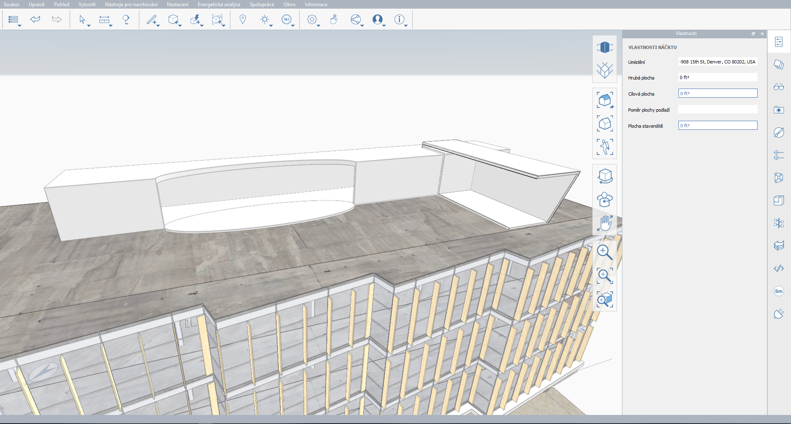

# 2.2 - 고급 모델링 도구: 쉘 및 피복

_쉘은 솔리드에서 지정된 두께를 사용하여 속이 빈 양식을 작성하고, 피복은 \(반드시 동일 평면 상에 있을 필요는 없는\) 모서리의 닫힌 루프에서 면을 작성합니다. 이는 간단하지만 강력한 도구로 거의 모든 형상 모양에서 양식을 빠르게 작성할 수 있습니다._

_이 연습에서는 쉘 및 피복을 사용하여_ _**Encode Campus Sample Model.axm**_ _의 맨 위에 펜트하우스를 작성하고,_ _**FormIt Primer 1부**에서 다루지 않은 다양한 기타 모델링 도구를 살펴보겠습니다. 아직 다운로드하지 않은 경우_ _**FormIt Primer 2부 데이터세트**_에서 파일을 다운로드할 수 있습니다.

## **펜트하우스 질량 모델링**

_먼저 다양한 모델링 도구를 사용하여 펜트하우스 질량 양식을 작성합니다. 설명을 따르거나 창의적인 아이디어를 내고 직접 디자인을 만들어 볼 수 있습니다._

1 - **Encode Campus Sample Model.axm**을 연 상태에서 **펜트하우스** 장면으로 이동합니다\(또는 주 건물의 지붕을 볼 수 있도록 뷰 및 레이어 조정\).

2 - 몇 가지 기하학적 원형을 사용하여 양식을 빠르게 작성해 보겠습니다.

1. **표준 도구막대**의 **원형 작성** 드롭다운 버튼에서 **정육면체\(Alt + B\)**를 선택합니다.
2. 정육면체 미리보기가 활성화된 상태에서 **Tab** 키를 눌러 치수\(폭: **100'**, 깊이: **15'**, 높이: **10'**\)를 설정한 후 아래 이미지와 유사한 위치의 지붕 위에 배치합니다. 구성요소를 배치하는 것과 마찬가지로 **공간**을 눌러 정육면체를 90도씩 회전할 수 있습니다.
3. 두 번째 **정육면체\(Alt + B\)**\(폭: **30’**, 깊이: **15’**, 높이: **12’**\)를 추가하고 **8.5**도 회전합니다. 그러면 정면의 각도와 일치하게 되어 긴 정육면체와 **98.5**도를 이룹니다. 아래 이미지와 유사하게 긴 정육면체와 교차하도록 이 정육면체를 배치합니다.

_**주:**_ _두 정육면체가 모두 지붕 표면 바로 위에 놓여 있는지 확인합니다. 정육면체를 이동할 때 실수로 높이가 바뀌기 쉽습니다._

3 - 상자를 보다 극적인 공간으로 만들기 위해 **경사 면\(TF\)** 도구를 사용하여 일부 면의 각도를 조정합니다.

1. 경사진 상자의 NE 또는 NW 면을 선택하고 마우스 오른쪽 버튼을 클릭하여 **상황에 맞는 메뉴**를 표시한 다음 **경사 면\(TF\)**을 선택합니다.
2. 면을 바깥쪽으로 **15**도 기울입니다. 많은 FormIt 도구와 마찬가지로 **Tab**키를 누르거나 숫자를 입력하기만 하면 됩니다.
3. 다음과 같이 인접한 면에 대해 동일한 작업을 수행합니다.

_**주:**_ _**경사 면\(TL\)**_ _도구에 있는 동안 선택한 면을 원하는 모든 축을 기준으로 회전할 수 있습니다. 원형 그립을 사용하여 회전 축(파란색 점선\)을 조정하기만 하면 됩니다._

4 - 양식을 좀 더 복잡하게 만들기 위해 다음과 같이 곡선을 추가해 보겠습니다.

1. **원형 작성** 드롭다운을 열고 이번에는 **원통**을 선택합니다.
2. 기본 반지름인 **6’**와 높이 **12’**를 사용하여 일단 지붕의 아무 곳에나 원통을 배치합니다.
3. **비균일 축척** 도구를 사용하여 원통을 긴 상자에 평행인 방향으로 **300%**까지 늘립니다. 축척 도구에 대한 자세한 내용은 **1.11 - 컨텐츠 라이브러리를 사용하여 모델 가져오기**
4. 다음과 같이 긴 축의 중심이 긴 상자의 모서리를 따르도록 원통을 이동합니다. 아래 두 번째 이미지에 사용된 **평면도\(VT\)**와 같이 뷰 간에 계속 전환하면 객체를 모델링하고 제 위치로 이동하는 데 도움이 됩니다.

_**주:**_ _지금까지 배치한 모양이 겹치는 경우에도 해당 면 또는 모서리를 두 번 클릭하여 각 모양을 개별적으로 선택할 수 있습니다. 이는 닫힌 모양을 배치\(또는 작성\)할 때마다 FormIt에서 '본체'로 인식하며 의도적으로 다른 모양과 결합할 때까지 형상을 함께 추적하기 때문입니다._

## **결합 및 절단**

_**형상 결합\(JG\)**_ _및_ _**형상 절단\(CG\)**_ _도구를 사용하여 방금 작성한 모양을 단일 양식으로 병합할 수 있습니다._

1 - 먼저 결합을 수행합니다.

1. **표준 도구막대**에서 **고급 형상 도구** 드롭다운을 클릭하고 **형상 결합\(JG\)** 도구를 선택합니다.
2. 그러면 **형상 결합 마법사**가 나타납니다. **1.9 - 상세정보 추가** 장의 **스윕** 도구를 다시 사용하는 것과 유사하게 모든 고급 형상 도구에는 사용 방법을 안내하는 고유한 마법사가 있습니다.
3. 상자 중 하나를 선택합니다. 단일 면이 아니라 전체 솔리드를 선택하려면 두 번 클릭해야 합니다. 마법사가 다음 단계로 자동으로 이동합니다.
4. 나머지 상자를 선택합니다.
5. 마법사에서 확인 표시를 클릭하여 결합을 완료합니다. 제대로 결합되었는지 확인하려면 두 번 클릭했을 때 새로 결합된 형상을 모두 선택할 수 있어야 합니다.

_**주:**_ _현재 선택한 항목에 결합할 수 있는 형상(예: 두 개\(2\) 이상의 겹치는 솔리드)이 이미 포함되어 있는 경우 선택한 형상을 마우스 오른쪽 버튼으로 클릭하면 나타나는 상황에 맞는 메뉴에서_ _**형상 결합\(JG)**_ _도구에 액세스할 수도 있습니다._

2 - 이제 상자 질량에서 타원을 절단합니다.

1. 형상을 선택하지 않은 상태에서 **고급 형상 도구**로 이동하고 **형상 절단\(CG\)**을 클릭합니다.
2. **형상 절단** **마법사**가 나타납니다. 절단할 때는 결합과 달리 형상을 선택하는 순서가 중요하므로 설명하는 내용을 주의 깊게 읽으십시오.
3. 먼저 **절단할 솔리드 선택**하는데, 이 예에서는 위에서 작성한 상자 질량입니다.
4. 그런 다음 **제거할 솔리드를 선택**합니다. 여기서는 타원형 원통입니다.
5. 마법사에서 확인 표시를 클릭하여 절단을 완료합니다.

_**주:**_ _다음 단계에서 살펴보겠지만 '제거됨'으로 설정된 타원은 삭제되지 않으나 해당 형상은 상자 형상에서 절단되었습니다._

3 - 마무리를 위해 타원의 상단 면을 **11’-6"**만큼 아래로 끌어 6” 두께의 플랫폼이 되도록 합니다. 나중에 이 플랫폼으로 루프탑 정원 파티오 만들기를 시작할 수 있습니다. 이제 방금 만든 절단부를 명확하게 볼 수 있습니다.

## **쉘 및 피복**

_질량이 구성되었으므로 __**쉘 솔리드\(s\) \(SH\)**__를 사용하여 모든 두께가 있는 벽, 바닥 및 지붕을 사용하여 공간을 신속하게 작성할 수 있습니다. 그런 다음_ _**피복\(CV\)**_ _을 사용하여 펜트하우스의 유리 면을 신속하게 생성할 수 있습니다._

1 - 전체 솔리드를 선택하면 쉘 도구가 모든 면에 있는 선택한 형상으로부터 간격띄우기 '쉘'을 작성하여 모든 면에서 속은 비어 있지만 계속 피복되도록 합니다. 일반적으로 쉘 도구를 사용하는 더 유용한 방법은 쉘에 포함하지 않을 솔리드의 면을 선택하는 것입니다. 복잡하게 들릴 수 있지만 사실은 매우 간단합니다. 아래에서 한 번 직접 해 보겠습니다.

1. **고급 모델링 도구**에서 **쉘 솔리드\(s\) \(SH\)**를 선택합니다.
2. **간격띄우기 거리** 대화상자가 나타나면 두께를 **-8"**로 입력하고 **확인**을 누릅니다.
3. 한 번 클릭하여 열어 둘 면 3개(곡선 표면 및 이전에 만든 경사 면 2개)만 선택합니다.
4. 마법사에서 확인 표시를 클릭하여 쉘을 완료합니다.

_**주:**_ _음수 쉘 간격띄우기 값은 새 표면을 모양 내부 쪽으로 간격을 띄우고 양수 값은 표면을 모양 외부 쪽으로 간격을 띄웁니다._

2 - 이제 펜트하우스가 거의 완성되었는데 벽이 몇 개 누락되었습니다. **피복\(CV\)** 명령을 사용하여 선택한 모서리 루프에서 일부 표면을 신속하게 만들 수 있습니다. 먼저 곡선 영역을 피복하겠습니다.

1. **고급 모델링 도구**에서 **피복\(CV\)**을 선택합니다.
2. 곡선 개구부 주위에서 모서리 네 개\(4\)를 모두 선택합니다. **Tab** 키를 사용하여 전체 곡선 모서리를 한 번에 선택해야 할 수도 있습니다.
3. 마법사에서 확인 표시를 클릭하여 피복을 완료합니다.

_**주:**_ _마법사를 사용하는 동안 선택 여부를 묻는 메시지가 표시될 때마다 고급 모델링 도구 중 하나 또는 dynamo 스크립트를 사용하든 상관 없이 여러 객체를 선택 취소하거나 선택할 때_ _**Ctrl**_ _또는_ _**Shift**_ _키를 누르고 있을 필요가 없습니다. 이전에 선택한 객체를 제거하려면 다시 클릭하기만 하면 됩니다._

3 - 경사 면이 있던 개구부에 대해서도 동일한 작업을 수행합니다. 설계를 따라 작업을 수행하는 경우 선택해야 하는 모서리가 여덟 개\(8\) 있습니다.

## **마무리 작업**

_펜트하우스의 마무리 작업을 위해 방금 작성한 표면에서 커튼월을 빠르게 만드는 몇 가지 방법을 시도해 보겠습니다._

1 - 내장 Dynamo **점두 커튼월** 스크립트를 사용하여 시작해 보겠습니다. FormIt에서 Dynamo를 처음 사용하는 경우 FormIt Primer 1부에서 **1.10 - Dynamo를 사용한 계산 그룹**을 참조하십시오.

1. **Dynamo 팔레트**에서 폴더 드롭다운이 **Dynamo 샘플**로 설정되어 있는지 확인합니다.
2. 아래로 스크롤하여 **점두 커튼월** 타일을 클릭합니다. 그러면 이 스크립트에 대한 마법사가 시작됩니다.
3. 캔버스에서 **피복\(CV\)** 도구를 사용하여 방금 만든 경사 표면 두 개를 선택합니다.
4. 마법사에서 확인 표시를 클릭한 다음 스크립트가 실행되기를 기다립니다. 이 작업은 몇 초 정도 걸릴 수 있습니다.
5. \(선택 사항\) 스크립트 매개변수를 업데이트하고 원하는 대로 멀리언 배치가 조정될 때까지 다시 실행합니다. 기본값에서 변경한 입력값은 다음과 같습니다.
   1. 멀리언 깊이: **0.5**
   2. 첫 번째 수평 멀리언 간격\(중심\): **4.833**
   3. 유형 수평 멀리언 간격\(중심\): **4.833**
6. 선택한 투명한 재료로 스크립트 입력에 사용한 표면을 페인트합니다. 여기서는 **유리 - 새로 만들기**를 사용했습니다.

_**주:**_ _FormIt 내에서 Dynamo의 고급 사용에 대해 자세히 알아보려면 Dynamo에 대해 구체적으로 다루는 Primer 2부 장인_ _**Dynamo FormIt 노드**를 참조하십시오._

2 - 안타깝게도 마지막 단계에서 사용한 스크립트가 곡선 표면에서 제대로 작동하지 않는 경우가 있습니다. 표면에 커튼월 모양을 빠르게 적용하는 또 다른 방법은 재료의 일부를 투명하게 만드는 **절단부분** 맵이 있는 재료를 사용하는 것입니다. FormIt에서는 커튼월에 대해 세 가지\(3\) 기본 재료가 제공됩니다. 이제 표면을 페인트한 다음 **재료 배치 조정** 도구를 사용하여 축척을 조정하기만 하면 됩니다.

1. **재료 팔레트**에서 **재료 샘플 &gt; 유리+글레이징**에서 **유리 - 스펜드럴을 사용한 점두**를 가져온 다음 이 재료로 곡선 표면을 페인트합니다. 재료 가져오기 및 사용에 대한 자세한 내용은 FormIt Primer 1부에서 **1.7장 - 재료로 페인트**를 참조하십시오.
2. 방금 페인트한 곡선 표면을 마우스 오른쪽 버튼으로 클릭하고 **재료 배치 조정** **\(MP\)**을 선택합니다.
3. UP 방향 표시 화살표 및 DN 방향 표시 화살표를 사용하여 얇은 수평 창 밴드 위의 멀리언이 곡선 개구부의 맨 위 모서리 바로 아래에 표시될 때까지 재료의 축척을 수직으로 조정합니다. 설계에서 높이를 **8’-7"**로 입력하면 제대로 작동하는 것을 확인했습니다.
4. 이제 수평 화살표를 사용하여 수직 멀리언이 경사 커튼월에 사용된 간격과 유사하게 약 3’ 떨어진 위치에 있도록 재료의 축척을 수평으로 조정합니다. 설계에서 값을 **9’**로 입력하면 제대로 작동하는 것을 확인했습니다.

3 - 설계에 마무리 작업을 추가합니다. 아래 완성된 이미지에서 지붕을 개선하기 위해 수행한 작업은 다음과 같습니다.

* **스윕\(SP\)**을 사용하여 지붕 윤곽에 바인딩된 파라펫을 추가했습니다.
* OOTB Dynamo 스크립트 **경로를 따라 배열**을 사용하여 지붕 둘레 주위에 스테핑 타일을 배치했습니다.
* 위에서 **재료 배치 조정** **\(MP\)** 도구를 사용하여 접합을 회전 및 정렬해 펜트하우스에 다양한 타일 재료를 추가했습니다.
* 일조 패널의 .skp 파일을 다운로드해 변환한 다음 모델로 가져왔습니다. 다양한 파일 유형 가져오기에 대한 자세한 내용은 **고급 내보내기 및 가져오기** 섹션을 참조하십시오.
* **스트링 조명 생성** 플러그인을 사용하여 스트링 조명 몇 개를 추가했습니다. 플러그인에 대해 자세히 알아보려면 2부: **플러그인**의 다음 장을 확인하십시오.

창의성을 발휘하여 모델을 이리 저리 자유롭게 바꿔보면서 이 장에서 다루지 못한 다른 고급 모델링 도구를 살펴보십시오. **모델 인코딩 데이터세트**에서 **Encode Campus Sample File\_Completed.axm**을 다운로드하고 열어 작성한 결과를 완성된 샘플 모델과 비교할 수 있습니다.

\_\_

