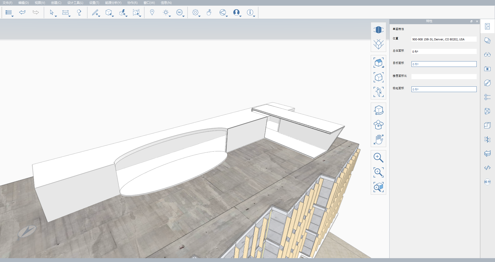

# 2.2 - 高度なモデリング ツール: シェル化とかぶり

_シェル化はソリッドから指定した厚さの空洞形状を作成し、かぶりはエッジ\(同一平面上でなくてもよい\)の閉じたループから面を作成します。これらは、ジオメトリのシェイプから形状をすばやく作成するための、簡単でありながら強力なツールです。_

_この演習では、_ _**Encode Campus Sample Model.axm**_ _の上にシェル化とかぶりを使用してペントハウスを作成します。また、_ _**FormIt Primer Part 1**に含まれていない他のさまざまなモデリング ツールについて説明します。まだダウンロードしていない場合は、_ _**FormIt Primer Part 2 Dataset**から上記のファイルをダウンロードできます。_

## **ペントハウスのマスをモデリングする**

_まず、さまざまなモデリング ツールを使用して、ペントハウスのマス形状を作成します。_説明どおりに作成することも、創造力を発揮して独自のデザインを作成することもできます。

1 - **Encode Campus Sample Model.axm** を開き、シーン **Penthouse** に移動します(メインの建物の屋根が見えるようにビューとレイヤを調整します)。

2 - ジオメトリ プリミティブを使用して、次の手順でフォームをすばやく作成します。

1. **[標準ツールバー]**で、**[プリミティブを作成]**ドロップダウン ボタンから**[立方体\([Alt]+[B]\)]**を選択します。
2. 立方体のプレビューをアクティブにした状態で、**[Tab]**キーを押して寸法\(**[幅]**: 100'、**[奥行き]**: 15'、**[高さ]**: 10'\)を設定し、屋根の上に配置して、下図と同じ位置にします。コンポーネントを配置するのと同様に、**[Space]**を押すことで立方体を 90 度間隔で回転できます。
3. 2 つ目の**立方体\([Alt]+[B]\)**を追加し\([幅]: **30'**、[奥行き]: **15'**、[高さ]: **12'**\)、**8.5** 度回転させて、ファサードの角度に一致し、長い立方体に対して **98.5** 度の角度となるようにします。この立方体を配置して、下の図のように長い立方体と交差させます。

_**注:**_ _両方の立方体が屋根サーフェス上に直接配置されていることを確認してください。移動するときに誤って高さを変更してしまうことがあります。_

3 - ボックスを最終的により印象的な空間にするために、**[面を傾斜\(TF\)]**ツールを使用して一部の面に角度を付けます。

1. 角度付きボックスの NE または NW 面を選択し、右クリックして**コンテキスト メニュー**から**[面を傾斜\(TF\)]**を選択します。
2. 面を外側に **15** 度傾斜させます。多くの FormIt ツールと同様に、**[Tab]**を押すか、そのまま数値の入力を開始できます。
3. 図に示すように、隣接する面に対しても同じ操作を行います。

_**注**_ _:_ _**[面を傾斜\(TF\)]**_ _ツールの使用中は、選択した面を任意の軸を中心に回転させることができます。回転の軸\(青色の点線\)を調整するには、円形のグリップを使用します。_

4 - 形状を少し複雑にするために、次の手順で曲線を追加します。

1. **[プリミティブを作成]**ドロップダウンを開き、今回は**[円柱]**を選択します。
2. 既定の半径 **6'**、高さ **12'** を使用し、この段階では屋根の任意の場所に円柱を配置します。
3. **[不均等スケール]**ツールを使用して、長いボックスと平行の方向に円柱を **300%** ストレッチします。スケール ツールの詳細については、「**1.11 - コンテンツ ライブラリを使用してモデルを読み込む」の章を参照してください。**
4. 図のように、円柱の長軸の中心が長いボックスのエッジに沿うように円柱を移動します。次の 2 番目の図で使用している**[上面ビュー\(VT\)]**のように、ビューを常に切り替えると、オブジェクトをモデリングする場合や、適切な位置へ移動する場合に役立ちます。

_**注:**_ _配置したシェイプが重なっている場合でも、面またはエッジのいずれかをダブルクリックして、各シェイプを個別に選択することができます。これは、閉じたシェイプを配置(または作成)すると常に、FormIt では 1 つの「ボディ」として認識され、意図的に他のシェイプと結合するまでジオメトリがまとめて追跡されるためです。_

## **結合と切り取り**

_[_ _**ジオメトリを結合 \(JG\)]**_ _ツールと_ _**[ジオメトリを切り取り \(CG\)]**_ _ツールを使用して、作成したばかりのシェイプを単一のフォームに結合できます。_

1 - まず、次の結合を実行します。

1. **[標準ツールバー]**で**[高度なジオメトリ ツール]**ドロップダウンをクリックし**、[ジオメトリを結合\(JG\)]**ツールを選択します。
2. これにより、**[ジオメトリを結合]ウィザード**が表示されます。**スイープ** ツールの使用(前の**「1.9 - 詳細を追加する」**の章)と同様に、高度なジオメトリ ツールにはすべて専用のウィザードがあり、それに従ってツールを使用します。
3. ボックスを 1 つ選択します。ダブルクリックして、単一面だけでなくソリッド全体を選択してください。ウィザードが自動的に次の手順に進みます。
4. 残りのボックスを選択します。
5. ウィザードのチェックマークをクリックして、結合を完了します。新しく結合したジオメトリすべてを 1 回のダブルクリックで選択できる場合は、正常に結合されています。

_**注:**_ _現在の選択に、ソリッドが 2 つ以上重なっているなど、結合可能なジオメトリが既に含まれている場合は、選択したジオメトリを右クリックして、コンテキスト メニューから_ _**[ジオメトリを結合 \(JG\)]**_ _ツールにアクセスすることもできます。_

2 - 次に、ボックスの形をしたマスから楕円を切り取ります。

1. ジオメトリを選択していない状態で、**[高度なジオメトリ ツール]**に移動し、**[ジオメトリを切り取り\(CG\)]**をクリックします。
2. **[ジオメトリを切り取り]** **ウィザード**が表示されます。ウィザードの内容をよく読んでください。切り取る場合は、結合する場合とは異なり、選択する順序が重要であるためです。
3. まず、**切り取られる側のソリッドを選択**します。この例では、上で作成したボックス形のマスです。
4. 次に、**除去するソリッドを選択**します。ここでは、楕円の円柱です。
5. ウィザードのチェックマークをクリックして、切り取りを完了します。

_**注:**_ _「除去する」ように設定された楕円は削除されませんが、次の手順で示すように、そのジオメトリがボックス ジオメトリから切り取られました。_

3 - 仕上げとして、楕円の上面を **11'-6"** 下にドラッグして、厚さ 6" のプラットフォームにします。後で屋上庭園のパティオを作成する際に、このプラットフォームから開始します。先ほど作成した切り取りをはっきりと確認できるはずです。

## **シェル化とかぶり**

_マスが作成されたので、_ _**[ソリッドをシェル化\(SH\)]**_ _を使用して、壁、床、屋根の厚さがすべて設定されたスペースをすばやく作成できます。次に、_ _**[かぶり\(CV\)]**_ _を使用して、ペントハウスにガラス面をすばやく作成できます。_

1 - ソリッド全体を選択した場合、シェル化ツールによって選択したジオメトリのすべての側面からオフセットされた「シェル」が作成されるため、中空は作成されますがすべての側面が覆われたままです。通常、シェル化ツールを使用する場合は、シェルに含めないソリッドの面を選択する方が実用的です。わかりにくいですか? 実際には非常に簡単です。以下で試してみます。

1. **[高度なモデリング ツール]**から、**[ソリッドをシェル化\(SH\)]**を選択します。
2. 表示される**[オフセット距離]**ダイアログで、厚さに **-8"** と入力し、**[OK]**を押します。
3. シングルクリックで、開いたままにする 3 つの面(前に作成した 1 つの曲面と 2 つの傾斜面)のみを選択します。
4. ウィザードのチェックマークをクリックして、シェルを完成させます。

_**注:**_ _負のシェル オフセット値を指定すると、新しいサーフェスはシェイプの内側に向かってオフセットされ、正の値を指定すると外側に向かってオフセットされます。_

2 - まもなくペントハウスが完成します。壁がいくつかないだけです。**[かぶり\(CV\)]**コマンドを使用すると、選択したエッジのループからすぐにサーフェスを作成できます。まず、曲面領域を覆います。

1. **[高度なモデリング ツール]**から、**[かぶり\(CV\)]**を選択します。
2. 曲面の開口部の周囲にある 4 つのエッジをすべて選択します。**[Tab]**キーを使用して、曲面のエッジ全体を一度に選択することが必要となる場合があります。
3. ウィザードのチェックマークをクリックして、かぶりを完成させます。

_**注:**_ _ウィザードの使用中に選択を求めるプロンプトが表示され、それが高度なモデリング ツールのいずれかまたは Dynamo スクリプトである場合は、_ _**[Ctrl]**_ _や_ _**[Shift]**_ _を押しながら複数のオブジェクトを選択解除したり選択する必要はありません。選択済みのオブジェクトを選択解除するには、もう一度クリックします。_

3 - 傾斜面がある開口部についても同じ操作を行います。この演習のデザインで作業を進めている場合は、選択が必要なエッジが 8 個あります。

## **仕上げ**

_ペントハウスの仕上げとして、先ほど作成したサーフェスからすばやくカーテン ウォールを作成する方法をいくつか紹介します。_

1 - 最初に組み込みの Dynamo スクリプト **Storefront Curtainwall** を使用します。FormIt で Dynamo を初めて使用する場合は、FormIt Primer Part 1 にある「**1.10 - Dynamo による計算グループ」**の章を参照してください。

1. **[Dynamo]パレット**で、フォルダのドロップダウンが**[Dynamo Samples]**に設定されていることを確認します。
2. 下にスクロールして、**[Storefront Curtainwall]**タイルをクリックすると、このスクリプトのウィザードが起動します。
3. **[かぶり\(CV\)]**ツールを使用して作成した 2 つの角度付きサーフェスを、キャンバスで選択します。
4. ウィザードのチェックマークをクリックし、スクリプトが実行されるまで待ちます。これは数秒かかる場合があります。
5. (省略可能)希望に合わせて調整されたマリオンのレイアウトになるように、スクリプトのパラメータを更新して再実行します。既定値から変更した入力値は次のとおりです。
   1. Mullion Depth: **0.5**
   2. First Horizontal Mullion Spacing (on center): **4.833**
   3. Typ. Horizontal Mullion Spacing (on center): **4.833**
6. スクリプトで入力したサーフェスを、希望の透明なマテリアルでペイントします。この例では **Glass - New** を使用しました。

_**注:**_ _FormIt における Dynamo の高度な使用方法の詳細については、Primer Part 2 の Dynamo を専門的に扱った「_ _**Dynamo FormIt ノード**」の章を参照してください。_

2 - 最後の手順で使用したスクリプトは、残念ながら曲面で正常に動作するとは限りません。サーフェスにカーテン ウォールの外観をすばやく設定する別の方法として、**カットアウト** マップを持つマテリアルを使用すると、マテリアルの一部が透明になります。FormIt には、カーテン ウォール用にこのようなマテリアルが 3 つ組み込まれています。必要な操作としては、そのマテリアルから 1 つを選択してサーフェスをペイントし、**[マテリアルの配置を調整]**ツールを使用してスケールすることだけです。

1. **[マテリアル]パレット**で、**Material Samples &gt; Glass+Glazing** から **Glass – Storefront with Spandrel** を読み込み、このマテリアルで曲面をペイントします。マテリアルの読み込みと使用の詳細については、FormIt Primer Part 1 にある「**1.7 - マテリアルでペイントする**」の章を参照してください。
2. ペイントした曲面を右クリックし、**[マテリアルの配置を調整****\(MP\)]**を選択します。
3. 上下の矢印を使用して、窓の細い水平バンドの上にあるマリオンが曲面の開口部の上端のすぐ下に表示されるまで、マテリアルを垂直にスケールします。このデザインでは、高さに **8'-7"** と入力すると適切に設定できます。
4. 次に横向きの矢印を使用して、垂直マリオンが傾斜面のカーテン ウォールで使用した間隔と同じくらい(約 3')離れるように、マテリアルを水平にスケールします。このデザインでは、値を **9'** にすると適切に設定できます。

3 - デザインに仕上げを追加します。次の完成イメージでは、拡張された屋根に次のようなパーツを追加しました。

* **[スイープ\(SP\)]**を使用してパラペットを追加し、屋根の輪郭に結合しました。
* OOTB Dynamo スクリプト **Array Along Path** を使用して、屋根の外周に段状のタイルを配置しました。
* ペントハウスにさまざまなタイル マテリアルを追加し、上記の**[マテリアルの配置を調整** **\(MP\)]**ツールを使用して結合を回転および位置合わせしました。
* ソーラー パネルの .skp ファイルをダウンロードして変換し、モデルに読み込みました。さまざまなファイル タイプの読み込みの詳細については、「**高度な書き出しと読み込み**」のセクションを参照してください。
* **Generate String Lights** プラグインを使用してストリング ライトを追加しました。プラグインの詳細については、Part 2 の「**プラグイン**」の章を参照してください。

モデルに独自の創造力を加えて、この章では触れなかった他の高度なモデリング ツールを試してみてください。自身で作成したモデルをここで完成させたサンプル モデルと比較するには、**Encode Model Data Set** から **Encode Campus Sample File¥_Completed.axm** をダウンロードして開きます。

\_\_

