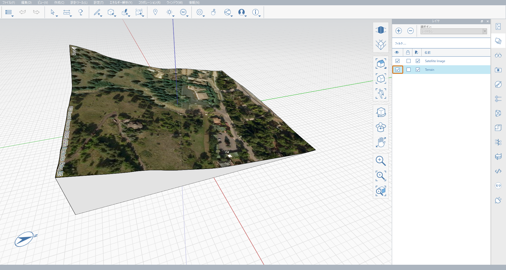
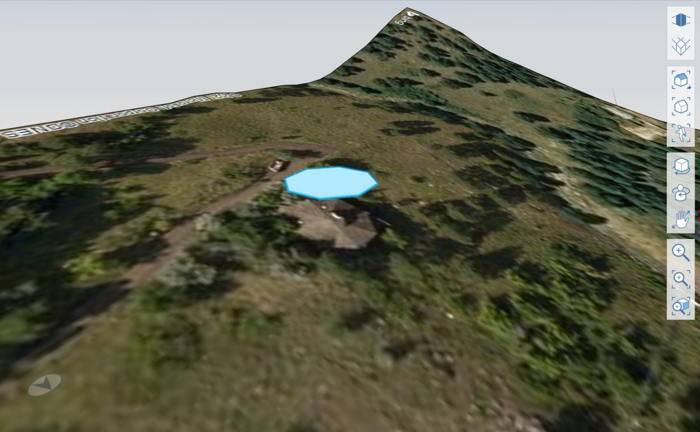
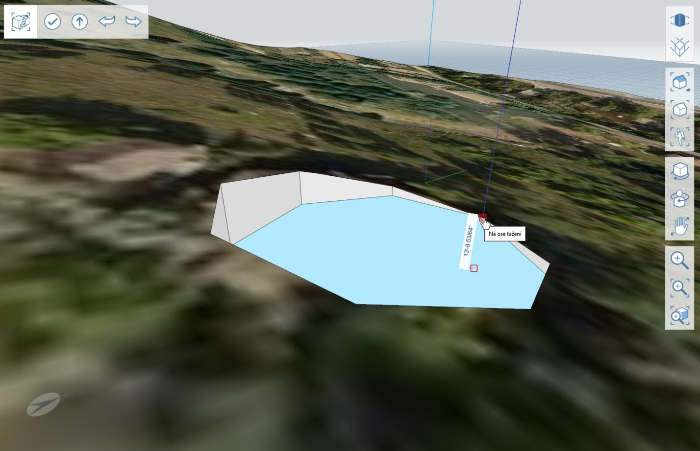
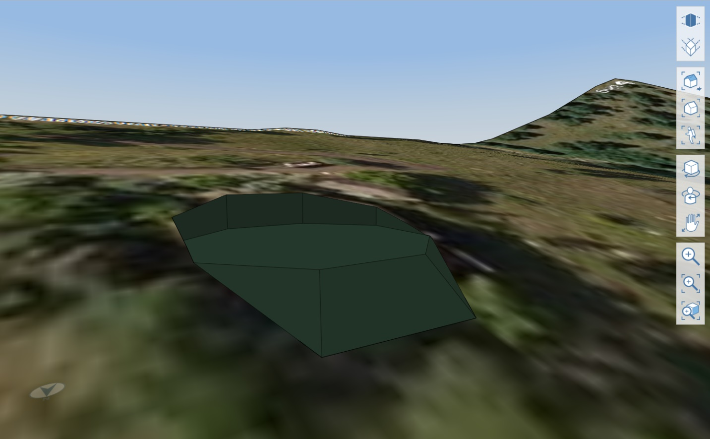

# 2.4 – Arbeitsabläufe für 3D-Gelände

_In diesem Kapitel erfahren Sie mehr über die Arbeit mit 3D-Gelände und die Verwendung mehrerer Werkzeuge, die in den vorherigen Kapiteln behandelt wurden. Anhand eines Grundstücks mit steiler Topografie werden Sie mit dem automatisch importierten Gelände die Geometrie vorbereiten und dann ein Loch für den Keller herausschneiden._

_Wenn Sie genau die in diesem Lernprogramm angegebene Position verwenden möchten, öffnen Sie die Datei_ _**2.4 – 3D Terrain Workflow\_Start.axm**_ _im Ordner_ _**FormIt Primer Part 2 Dataset**._

1 – Starten Sie eine neue FormIt-Datei, und importieren Sie das 3D-Gelände mithilfe des Werkzeugs **Standort festlegen \(SL\)**. Verwenden Sie die Adresse **120 Arapahoe Ave, Boulder, CO 80302**, und wählen Sie eine Region für den Import aus, die der unten stehenden Abbildung ähnelt. Achten Sie darauf, dass das achteckige Gebäude ebenfalls importiert wird. \(Wenn Sie die Datei _**2.4 – 3D Terrain Workflow\_Start.axm**_ verwenden, können Sie diesen Schritt überspringen.\)

_**Anmerkung:**_ _Weitere Informationen zur Verwendung des Werkzeugs_ _**Standort festlegen \(SL\)**_ _finden Sie im Kapitel **1.1 – Festlegen des Standorts** in **Teil I**._

2 – Aktivieren Sie in der **Layer-Palette** den Layer **Terrain**, der beim Import des Geländes automatisch erstellt wurde.

3 – Das 3D-Gelände wird als Netzobjekt importiert, doch vor dem Ändern muss das Gelände in ein FormIt-Geometrieobjekt konvertiert werden. Dies kann mithilfe des Werkzeugs **Netze in Objekte \(MO\)** erfolgen:

1. Bearbeiten Sie die Gruppe **Gelände**, und wählen Sie alle Flächen in dieser Gruppe aus.
2. Klicken Sie mit der rechten Maustaste auf eine der ausgewählten Flächen, um das Kontextmenü aufzurufen.
3. Wählen Sie das Werkzeug **Netze in Objekte \(MO\)** aus. Das Netz wird automatisch in ein FormIt-Objekt konvertiert.
4. Beenden Sie die Bearbeitung der Gruppe. 

_**Anmerkung:**_ _Was ist ein Netz? Kurz gesagt:_ _**Netze**_ _sind vereinfachte Darstellungen von Geometrie,_ _**Objekte**_ _sind jedoch besser bearbeitbar. Weitere Informationen finden Sie im Kapitel_ _**Netze**_ _in der_ _**Werkzeugbibliothek**._

4 – Im nächsten Schritt erstellen Sie ein zweites Objekt, das Sie zum Schneiden des Geländes verwenden werden. In diesem Beispiel erstellen Sie ein Achteck basierend auf einem vorhandenen Gebäude auf dem Grundstück.

1. Deaktivieren Sie den Layer **Terrain**.
2. Zeichnen Sie ein **Polygon \(Y\)** mit **8** Seiten und einem Radius von **30'**, und platzieren Sie es auf der **XY-Ebene**
3. Verschieben Sie das Achteck aus der **Draufsicht \(VT\)**, sodass es sich direkt über dem ähnlich geformten Gebäude befindet, das im Satellitenbild zu sehen ist.
4. Verschieben Sie das Achteck vertikal um **150'** entlang der blauen Achse \(**Z-Achse**\) nach oben.
5. Aktivieren Sie den Layer **Terrain** wieder.

5 – Als Nächstes schneiden Sie in das Gelände. Weitere Informationen zur Verwendung des Werkzeugs Ausschneiden und anderer erweiterter Modellierungswerkzeuge finden Sie in Kapitel **2.2 – Erweiterte Modellierungswerkzeuge**.

1. Extrudieren Sie die Fläche nach unten, sodass sie ein Stück unter die obere Fläche der Gruppe **Terrain** reicht.
2. Verwenden Sie das Werkzeug **Geometrie ausschneiden \(CG\)**, um die Extrusion aus dem **Gelände** auszuschneiden.
3. Löschen Sie das Achteck, das Sie gerade verwendet haben, um das Gelände zu schneiden. Es sollte nur noch ein achteckiges Loch angezeigt werden.

6 – Extrudieren Sie die untere Fläche des Schnitts, um die Tiefe des Kellers anzupassen. In diesem Beispiel haben Sie die Basis am niedrigsten Punkt des Grundstücks ausgerichtet.

7 – Um mit einigen weiteren FormIt-Funktionen zu experimentieren, können Sie das Gelände wie folgt weiter bearbeiten:

1. Verwenden Sie das **Extrusionswerkzeug** erneut, um die Basistiefe anzupassen, sodass sie ungefähr in der Mitte zwischen dem höchsten und niedrigsten Punkt des Achtecks liegt.
2. Erstellen Sie ein neues Material, und wenden Sie es auf die Flächen ohne Material an.
3. Verwenden Sie das Werkzeug **Fläche neigen \(TF\)**, um einen weicheren Übergang zwischen der Basisneigung und dem natürlichen Gelände zu erstellen. Jetzt haben Sie eine schöne Plattform erstellt, auf der Sie das achteckige Gebäude basierend auf den tatsächlichen Geländedaten des Grundstücks erstellen können.

_**Anmerkung:**_ _Weitere Informationen zum Werkzeug_ _**Fläche neigen \(TF\)**_ _finden Sie im Kapitel_ _**2.2 – Erweiterte Modellierungswerkzeuge**._

_**Anmerkung:**_ _Um Ihre Ergebnisse mit denen in der Beispieldatei zu vergleichen, sehen Sie sich die Datei_ _**2.4 – 3D Terrain Workflow\_Completed.axm**_ _im Ordner_ _**Encode Model Data Set** an._

