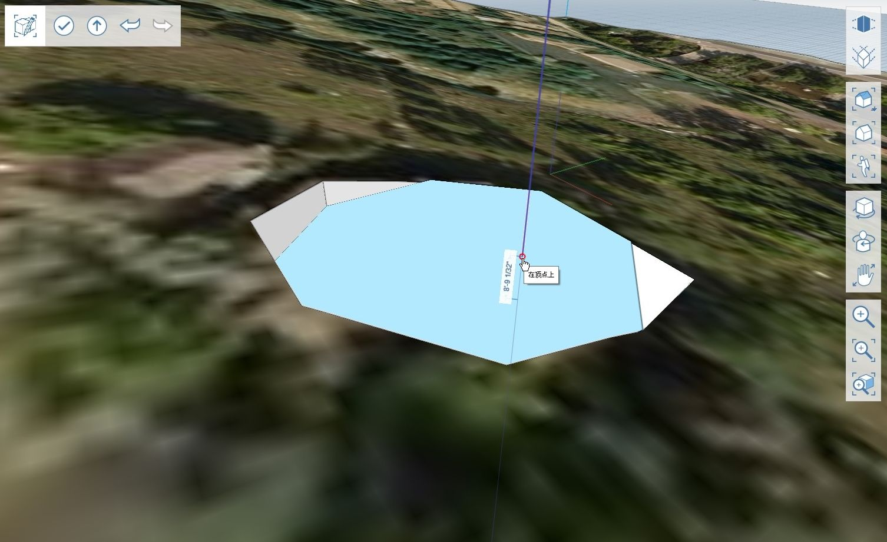

# 2.4 — Procesy robocze terenu 3D

_W tym rozdziale omówimy pracę z terenem 3D, korzystając z wielu narzędzi opisanych w poprzednich rozdziałach. Wykorzystując teren o stromej topografii, weźmiemy automatycznie zaimportowany teren, przygotujemy geometrię, a następnie wytniemy z niej otwór na piwnicę._

_Jeśli chcesz użyć dokładnie tej samej lokalizacji co w tym samouczku, otwórz plik_ _**2.4 – 3D Terrain Workflow\_Start.axm**_ _z zestawu danych_ _**FormIt Primer Part 2 Dataset**._

1 — Utwórz nowy plik programu FormIt i zaimportuj teren 3D za pomocą narzędzia **Lokalizacja \(SL\)**. Użyj adresu „**120 Arapahoe Ave, Boulder, CO 80302”** i wybierz region do zaimportowania podobny do pokazanego na poniższej ilustracji, obejmujący ośmiokątny budynek. \(Jeśli rozpoczynasz pracę od pliku _**2.4 – 3D Terrain Workflow\_Start.axm**_, możesz pominąć ten krok.\)

_**Uwaga:**_ _Aby uzyskać więcej informacji na temat sposobu korzystania z ustawionego narzędzia_ _**Lokalizacja \(SL\)**_, zobacz część _**Part I** rozdział **1.1 — Ustawianie lokalizacji**._

2 — W **palecie Warstwy** włącz warstwę **Terrain**, która została automatycznie utworzona podczas importowania terenu.

3 — Teren 3D jest importowany jako obiekt siatki, ale zanim zostanie zmodyfikowany, należy przekształcić go w obiekt geometrii programu FormIt. Można to zrobić za pomocą narzędzia **Siatki na obiekty \(MO\)**:

1. Przeprowadź edycję grupy **Terrain** i wybierz wszystkie powierzchnie w tej grupie.
2. Kliknij prawym przyciskiem myszy dowolną z wybranych powierzchni, aby wywołać menu kontekstowe.
3. Wybierz narzędzie **Siatki na obiekty \(MO\)**. Siatka zostanie automatycznie przekształcona w obiekt programu FormIt.
4. Zakończ edycję grupy.

_**Uwaga:**_ _Czym jest siatka? Krótko mówiąc,_ _**siatki**_ _to lekkie reprezentacje geometrii, ale_ _**obiekty**_ _lepiej nadają się do edycji. Aby uzyskać więcej informacji, zobacz temat_ _**Siatki**_ _w_ _**Bibliotece narzędzi**._

4 — Następnym krokiem jest utworzenie drugiego obiektu, którego użyjemy do wycięcia terenu. W tym przykładzie utworzymy ośmiokąt na podstawie budynku istniejącego w terenie.

1. Wyłącz warstwę **Terrain**.
2. Narysuj **wielobok \(Y\)** o **8** bokach i promieniu **30’**, a następnie umieść go na **płaszczyźnie XY.**
3. Korzystając z opcji **Widok z góry \(VT\)**, przenieś ośmiokąt tak, aby znajdował się bezpośrednio nad budynkiem o podobnym kształcie widocznym na obrazie satelitarnym.
4. Przesuń ośmiokąt pionowo w górę o **150’** wzdłuż niebieskiej osi \(**Oś Z**\).
5. Włącz z powrotem warstwę **Terrain**.

5 — Następnie zrobimy wycięcie w terenie. Aby uzyskać więcej informacji na temat sposobu wycinania i innych narzędzi do modelowania, zobacz rozdział **2.2 — Zaawansowane narzędzia modelowania**.

1. Wyciągnij powierzchnię w dół, aby zagłębić ją o kilka stóp poniżej górnej powierzchni grupy **Terrain**.
2. Za pomocą narzędzia **Dotnij geometrię \(CG\)** wytnij wyciągnięcie z grupy **Terrain**.
3. Usuń ośmiokąt, którego użyliśmy do wycięcia terenu. Powinien pozostać tylko otwór w kształcie ośmiokąta.

6 — Wyciągnij dolną powierzchnię wycięcia, aby dostosować głębokość piwnicy. W tym przykładzie wyrównaliśmy podstawę do najniższego punktu w terenie.

7 — Aby wypróbować kilka innych funkcji programu FormIt, możesz kontynuować manipulowanie terenem w następujący sposób:

1. Użyj ponownie **narzędzia do wyciągania**, aby dostosować głębokość podstawy do połowy odległości między najwyższym i najniższym punktem ośmiokąta.
2. Utwórz nowy materiał i zastosuj go na niepomalowanych powierzchniach.
3. Użyj narzędzia **Pochyl powierzchnię \(TF\)**, aby utworzyć gładsze przejście między nachyleniem podstawy a naturalnym terenem. Teraz mamy dobrą platformę, na której możemy postawić ośmiokątny budynek, korzystając z rzeczywistych danych terenu budowy.

_**Uwaga:**_ _Aby dowiedzieć się więcej na temat narzędzia_ _**Pochyl powierzchnię \(TF\)**_ _, zobacz rozdział_ _**2.2 — Zaawansowane narzędzia modelowania**._

_**Uwaga:**_ _Aby porównać swoje wyniki z naszymi, zobacz plik_ _**2.4 – 3D Terrain Workflow\_Completed.axm**_ _z zestawu danych_ _**Encode Model Data Set**._

