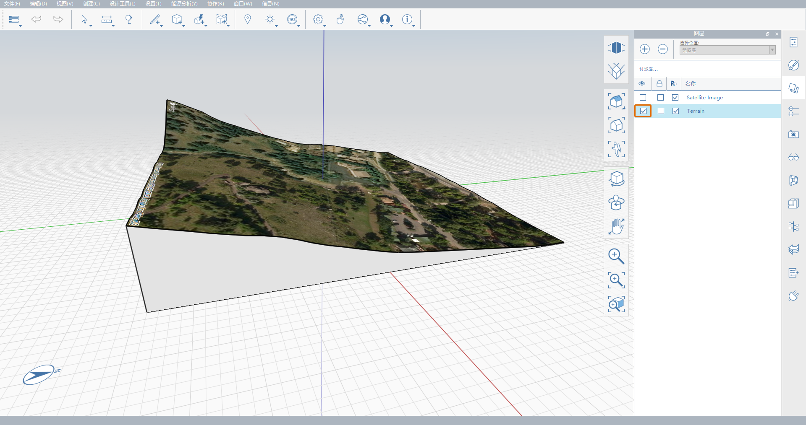

# 2.4 – Práce s 3D terénem

_V této kapitole se budeme zabývat prací s 3D terénem, přičemž využijeme několik nástrojů popsaných v předchozích kapitolách. Na pozemku se strmou topografií vybereme terén, který se automaticky importuje, připravíme geometrii a poté z ní vyřízneme díru pro základy._

_Pokud chcete použít přesně stejné umístění jako v tomto návodu, otevřete soubor_ _**2.4 – 3D Terrain Workflow\_Start.axm**_ _z_ _**datové sady k příručce Základy aplikace FormIt, Část 2**._

1 – Vytvořte nový soubor aplikace FormIt a importujte 3D terén pomocí nástroje **Umístění \(SL\)**. Použijte adresu **120 Arapahoe Ave, Boulder, CO 80302** a vyberte oblast, kterou chcete importovat, podobně jako na obrázku níže. Ujistěte se, že jste zahrnuli budovu ve tvaru osmiúhelníku. \(Pokud pracujete se souborem _**2.4 – 3D Terrain Workflow\_Start.axm**_, můžete tento krok přeskočit.\)

_**Poznámka:**_ _Další informace o použití nástroje_ _**Umístění \(SL\)**_ _naleznete v **části I** v kapitole **1.1 – Nastavení umístění**._

2 – Na **paletě Hladiny** zapněte hladinu **Terén**, která se automaticky vytvořila při importu terénu.

3 – 3D terén se importuje jako objekt sítě, ale před jeho úpravou je nutné terén převést na objekt geometrie aplikace FormIt. Můžete to provést nástrojem **Sítě na objekty \(MO\)**:

1. Upravte skupinu **Terén** a vyberte všechny plochy v této skupině.
2. Kliknutím pravým tlačítkem na libovolnou z vybraných ploch zobrazte místní nabídku.
3. Vyberte nástroj **Sítě na objekt \(MO\)**. Síť bude automaticky převedena na objekt aplikace FormIt.
4. Dokončete úpravy skupiny.

_**Poznámka:**_ _Co je síť? Stručně řečeno,_ _**sítě**_ _jsou zjednodušené reprezentace geometrie, zatímco_ _**objekty**_ _je možné více upravovat. Další informace naleznete v kapitole_ _**Sítě**_ _v_ _**knihovně nástrojů**._

4 – V dalším kroku vytvoříme druhý objekt, který použijeme k vyříznutí terénu. V tomto příkladu vytvoříme osmiúhelník na základě existující budovy na pozemku.

1. Vypněte hladinu **Terén**.
2. Nakreslete **polygon \(Y\)** o **8** stranách a poloměru **30'** a umístěte jej do roviny **XY**
3. V **horním pohledu \(VT\)** přesuňte osmiúhelník tak, aby byl přímo nad podobně tvarovanou budovou viditelnou na satelitním snímku.
4. Posuňte osmiúhelník vertikálně nahoru o **150’** podél modré osy \(**osa Z**\).
5. Opět zapněte hladinu **Terén**.

5 – Nyní vyřízneme terén. Další informace o používání řezů a dalších pokročilých nástrojů modelování naleznete v kapitole **2.2 – Pokročilé nástroje modelování**.

1. Vysuňte plochu směrem dolů tak, aby se posunula několik stop pod horní plochu skupiny **Terén**.
2. Pomocí nástroje **Oříznout geometrii \(CG\)** vyřízněte vysunutí z **terénu**.
3. Odstraňte osmiúhelník, který jste právě použili k vyříznutí terénu. Měl by zůstat jen otvor ve tvaru osmiúhelníku.

6 – Vysunutím dolní plochy řezu upravte hloubku základů. V tomto příkladu jsme základnu zarovnali k nejnižšímu bodu na pozemku.

7 – Chcete-li experimentovat s několika dalšími funkcemi aplikace FormIt, můžete pokračovat v manipulaci s terénem následujícím způsobem:

1. Pomocí **nástroje Vysunutí** znovu upravte hloubku základny tak, aby byla přibližně uprostřed mezi nejvyšším a nejnižším bodem osmiúhelníku.
2. Vytvořte nový materiál a aplikujte jej na nemalované plochy.
3. Pomocí nástroje **Naklonit plochu \(TF\)** vytvořte měkčí přechod mezi úrovní základny a přírodním terénem. Nyní máme pěknou platformu pro stavbu osmiúhelníkové budovy, která vychází ze skutečných terénních dat pozemku.

_**Poznámka:**_ _Další informace o nástroji_ _**Naklonit plochu \(TF\)**_ _naleznete v kapitole_ _**2.2 – Pokročilé nástroje modelování**._

_**Poznámka:**_ _Chcete-li porovnat své výsledky s našimi, podívejte se na soubor_ _**2.4 – 3D Terrain Workflow\_Complete.axm**_ _z_ _**datové sady modelu Encode**._

