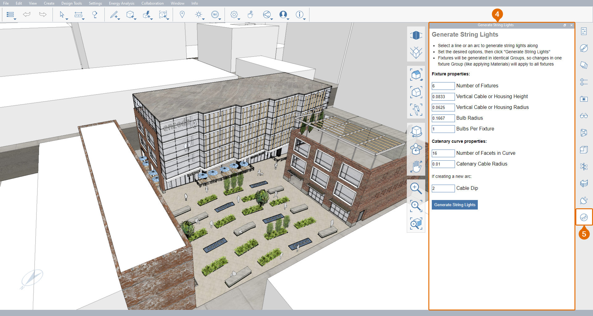

# 2.5 - 外掛程式

FormIt 隨附幾個擴充其內建功能的外掛程式。您也可以安裝由 AEC 社群開發的外掛程式，甚至建置您自己的外掛程式。

_在本章中，我們將以 FormIt 隨附的一些外掛程式作為例子，以對_ _**Encode Campus Sample Model.axm**做一些改進。如果您還沒下載，可以從_ _**FormIt 入門手冊第 2 部分資料集**下載檔案。_

## 安裝外掛程式

1 - 開啟 **Encode Campus Sample Model.axm** 後，我們來安裝第一個外掛程式：

1. 按一下插頭圖示，開啟**「外掛程式管理員」選項板**。
2. 展開**「建議」**下拉式功能表。
3. 向下捲動並找到 **Generate String Lights** 外掛程式，然後按一下外掛程式名稱右側的滑棒進行安裝。
4. 安裝外掛程式後，其選項板會自動開啟。
5. 新圖示也應顯示在其他所有選項板圖示的下方。

2 - 重新開啟**「外掛程式管理員」選項板**，再重複此程序兩次，以安裝 **Manage Cameras** 和 **Properties Plus** 外掛程式。

3 - 確認全部三個外掛程式都已成功安裝：

1. 最小化**「建議」**下拉式清單，然後展開**「已安裝」**下拉式清單。這是一個只查看已安裝外掛程式的簡單方式。
2. 大多數 (但不是所有) 外掛程式也隨附自己的圖示，應該已經加到選項板圖示工具列中。您可以隨時返回**「外掛程式管理員」選項板**，開啟或關閉外掛程式滑棒，這會在 FormIt 階段作業中加入或移除外掛程式及其圖示。
3. 如果您安裝的外掛程式圖示太多而無法在螢幕上顯示，您可以在主**功能表列**的**「視窗」**下拉式清單中切換某些未使用的外掛程式圖示，以隱藏這些圖示。

## 使用外掛程式 - Generate String Lights

_這個簡潔的外掛程式可讓您在模型中根據直線或曲線加入懸掛的燈。_

1 - 加入任何新燈光之前，我們先在模型中使用預先製作的場景來查看預期結果。

1. 若要跳至包含既有燈串的場景，請開啟**「場景」選項板**，然後按兩下名為 **Eye Level – Short Alley** 的場景。
2. 請注意此模型隨附的燈串，這是我們要重新建立的，但在其他地方。
3. 在**「圖層」選項板**中，開啟 **Helper Geometry** 圖層，您可以看到用來產生這些燈串的原始線條。

2 - 我們現在導覽到其他條路，並加入一些燈光。在**「場景」選項板**中，開啟 **Eye Level – Long Alley** 場景。請注意，這條路還沒有任何燈串。

3 - 建立新的燈串：

1. 按一下燈串圖示，以開啟新安裝的**「Generate String Lights」選項板**。新外掛程式的圖示預設會顯示在底部。
2. 將**「Number of Fixtures」**選項變更為 **10**。
3. 按兩下其中一條輔助線，以編輯預先建立的 **String Lights – Long Alley** 群組。然後按一下其中一條預先繪製的輔助線以選取它。
4. 按一下外掛程式選項板內的**「Generate String Lights」**按鈕，新的燈串應該就會出現！請注意，每個燈串都是以自己的唯一群組建立的。

_**注意事項：**_ _某些線條會穿過「Groove Coffee」標誌沒關係，因為燈串外掛程式會建立一條懸垂曲線在標誌下面真實地下垂。_

4 - 嘗試使用其他預先製作的輔助線和/或建立您自己的輔助線，來建立更多燈串。使用外掛程式的設定實驗看看，以獲得不同的結果。

5 - 為了協助讓模型保持井然有序，建議在完成時將所有輔助線分組，並將該群組放在 **Helper Geometry** 圖層上，以及將所有燈串群組指定到 **Context – Exterior Lighting** 圖層。這可以避免輔助線出現在我們不想看到它們的任何「Eye Level」場景中。完成後，結果應該會與下一張螢幕快照類似。

_**注意事項：**_ _與從 Dynamo 指令碼建立的幾何圖形 \(可透過_ _**「性質」選項板**更新和重生\) 不同，外掛程式建立的物件 \(大部分\) 只是一般的 FormIt 幾何圖形。建立後，只能使用 FormIt 內建的塑型工具進行編輯。_

## Manage Cameras 外掛程式

_在整本手冊中，我們一直使用場景作為導覽和控制整個模型可見性的重要工具。此外掛程式可讓我們查看和編輯目前相機的高程、將每個場景的相機匯出為 3D 物件，以及在模型之間複製這些場景。_

1 - 首先，我們將調整 **Eye Level – Long Alley** 場景，使其相機真的位於視線高度：

1. 如果還不在場景中，請在**「場景」選項板**內按兩下**「Eye Level – Long Alley」**場景回到該場景。
2. 使用齒輪圖示按一下相機，開啟**「Manage Cameras」選項板**。
3. 將**「Height Above Ground」**變更為 **5'-8"**。

_**注意事項：**_ _如果模型有樓層，此外掛程式也會顯示低於_ _**Main Camera**高於最接近樓層的高度。_

2 - 然後：

1. 返回**「場景」選項板**。
2. 確保仍選取**「Eye Level – Long Alley」**場景 \(否則按一下以選取它)。
3. 按一下**「更新場景」**按鈕，將新相機高度儲存至此場景。

_**注意事項：**_ _您也可以切換_ _**「場景」選項板**_ _頂部的_ _**「編輯場景相機」**_ _按鈕 \(在「更新」和「播放」按鈕之間\)，來調整場景相機的角度和位置。_

3 - 接下來，將場景匯出至新模型。首先，我們必須使用 **Manage Cameras** 外掛程式為所有場景建立相機物件：

1. 再次開啟**「Manage Cameras」選項板**。
2. 確保已勾選**「Copy Cameras to Clipboard」**選項。
3. 按一下**「Export Scenes to Cameras」**按鈕。這可能需要幾秒鐘時間。
4. 如果整個畫布變白，這是因為您的 **Main Camera** 與其中一個場景相機對齊。**拉遠 \(Z\)**，直到您可以看到 3 個主建築和新建立的相機物件。請注意，相機物件會自動放在名為 **Cameras** 的大型群組中。在該群組內，每個個別相機都會放在自己的群組中，名稱與建立自該群組的場景名稱相同。

4 - 我們將這些場景複製到新模型。由於相機資料已儲存至剪貼簿，因此我們無需執行太多動作：

1. **儲存** ** \(Ctrl + S\)** 您的目前模型，然後將其關閉。
2. 從**主功能表**列的**「檔案」**下拉式清單中選取**「新建草圖 \(Ctrl + N\)」**，以開始新的空草圖。
3. 開啟 **Manage Cameras** 外掛程式 \(如果其尚未開啟\)，並確保已勾選**「Look for Cameras on Clipboard」**選項。
4. 按一下外掛程式底部附近的**「Import Scenes from Cameras」**按鈕，將匯入其他模型中的場景。若要檢查，請開啟**「場景」選項板**和/或開啟**「相機」**圖層。您將會看到所有場景和 3D 相機物件都已匯入到此模型中。

## Properties Plus 掛程式

_此外掛程式是一個進階版的_ _**「性質」選項板**。如果您選取幾何圖形的多個群組和/或類型，此外掛程式將提供您選取項目的明細，而且允許批量更名群組和群組實體。_

1 **-** 首先，我們將從主模型查看門群組的性質。重新開啟 **Encode Campus Sample Model.axm**，並返回 **Eye Level - Long Alley** 場景。開始使用 **Properties Plus** 外掛程式：

1. 按一下帶有「加號」圖示的性質，開啟**「Properties Plus」選項板**。
2. 確保已勾選**「Update on Selection Change」**。
3. 選取路右側名為 **Door** 的其中一個雙層玻璃門群組。
4. 在**「Selection Count」**區域中，**「Total Objects」**會告知我們已選取一個 \(**1**\) 物件。
5. 在下方，我們可以找到已選取哪些類型物件的更多資訊。在此案例中，已選取一個 \(**1**\) 群組，但該群組在模型中有四個 \(**4**\) 實體。

_**注意事項：**_ _查看所選群組的實體數目非常方便，可防止在您實際只想變更所選元素，但忘記先將其設為唯一時，意外變更多個元素。_

2 - 此外掛程式可讓我們編輯群組或群組實體的名稱，而無需進入群組編輯模式，以及一次更名多個實體。我們先前知道，每個群組都有名稱，但該群組的每個實體也可以有唯一的「實體」名稱。由於此模型中很可能有許多類型的門，因此我們要為此群組及其某些實體指定更具體的名稱。

1. 在第一個玻璃**門**群組仍處於選取狀態時，按住 **Shift** 或 **Ctrl**，並按一下第一個玻璃門附近的另一個雙層玻璃**門**群組，將另一個**門**群組加到目前選取範圍。
2. 請注意，**「Properties Plus」選項板**現在更新了其**「Selection Count」**，顯示已選取兩個 \(**2**\) 實體，但仍然只選取一個 \(**1**\) 唯一的**族群** \(也就是群組\)。\(即使此外掛程式使用的是 Revit 使用者熟悉的**族群**術語，但是在此環境中，它與 FormIt 群組意義相同。\)
3. 在**「Group Family」**區域下，將**「Name」**欄位更新為**「Doors – Double Glass Storefront」**。無論實體在何處，或目前是否選取，這都會更新所有實體之名稱群組的名稱，而無需按兩下並編輯群組。
4. 由於這兩個實體都是 Groove Coffee 區域的門，因此可以在**「Multiple Group Instances」**區域下的**「Name」**欄位中輸入**「Groove Coffee Door」**只更名這兩個實體。

**注意事項：**在標準**「性質」選項板**中，無法一次更名群組的多個實體。當您要一次更名數十個或數百個名稱相同的實體時，這會非常方便。

_**注意事項：**_ _如果滑鼠離開選項板，您就無法再編輯選取的文字方塊。所有選項板都是如此，因此在編輯選項板內的任何內容時，請務必將游標保持在選項板邊界內。_

3 - 現在，如果您選取某扇 Groove Coffee 玻璃門或其他玻璃門，並在一般的**「性質」選項板**中查看性質，您會看到每個實體的**群組**名稱都已更新，但只有 Groove Coffee 門的實體**「名稱」**性質已從其預設值更新。

4 - 最後，我們來看看此外掛程式如何排序不同類型的元素：

1. 在模型中您想要的任意位置快速繪製**線 \(L\)**、**矩形 \(R\)**和**立方體 \(Alt + B\)**。這些是暫時的，因此精確位置並不重要。
2. 重新開啟**「Properties Plus」選項板** \(如果已關閉\)，然後按 **Crtl + A** 選取模型中所有可見元素。
3. 查看**「Selection Count」**區域，請注意選取的元素已分為 **Edges** \(線\)、**Faces**、**Bodies**、\(由面和邊組成的 3D 造型，如立方體3\)**、** **Groups** 等等。

_**注意事項：**_ _此外掛程式也會偵測_ _**Vertices**，可使用另一個稱為_ _**Generate Vertex**的外掛程式建立。如果您想要實驗，請安裝 __**Generate Vertex 外掛程式**__，然後重複上述步驟。_

## Plugin Playground

_對於現場的繪圖員和開發人員，FormIt 還隨附了一個外掛程式，可讓您在 FormIt 內建立和測試您自己的自訂外掛程式。您必須擁有 HTML、CSS 和 JavaScript 的相關知識才能充分運用此工具，因此我們不會在這裡詳細介紹，但如果您有興趣了解更多資訊，可以造訪_ [_**Building FormIt JavaScript Plugins**_](https://formit3d.github.io/FormItExamplePlugins/docs/HowToBuild.html)_。_

1 - 您可以按照我們從**「外掛程式」選項板**安裝先前外掛程式的方式安裝 **Plugin Playground**。

2 - 以下是 **Plugin Playground** 的基本概述：

1. 按一下 _&lt;_鉛筆_&gt;_ 圖示，開啟**「Plugin Playground」選項板**。
2. 在選項板內，按一下**「編輯」**按鈕，以開啟內建程式碼編輯器來建立自訂外掛程式。此外掛程式已預先載入一個建立立方體之外掛程式的程式碼。
3. 按一下**「播放」**按鈕，測試會執行目前的程式碼。在此案例中，建立立方體的外掛程式內容將顯示在選項板中。

