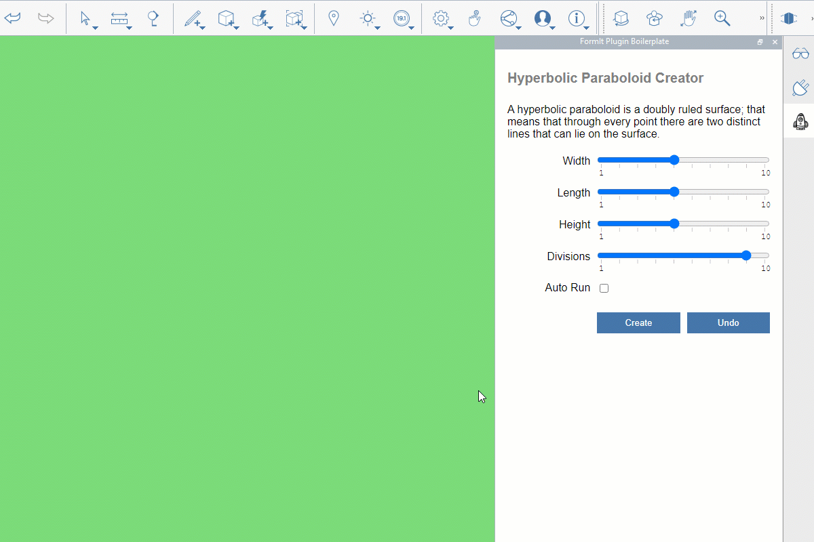

# Plugins

Plugins can improve your Autodesk FormIt® experience by expanding your modeling toolset. You can address specific design needs that are not included in FormIt's tool library.&#x20;

The Plugins section of this primer includes four chapters:

1. [Introduction to Plugins](introduction.md): Basic information you need to know about Plugins.
2. [How to Use Plugins](how-to-use-plug-ins/): If you are a FormIt user and want to give Plugins a try, this section will guide you through the process of installing and using Plugins.
3. [How to Develop Plugins](how-to-use-plug-ins/): If you are a developer and want to go the extra mile, this section will guide you through the steps needed to develop a FormIt Plugin.
4. [Examples:](example-1/) If you want to try out existing Plugins, this section contains descriptions of some of the available Plugins.

