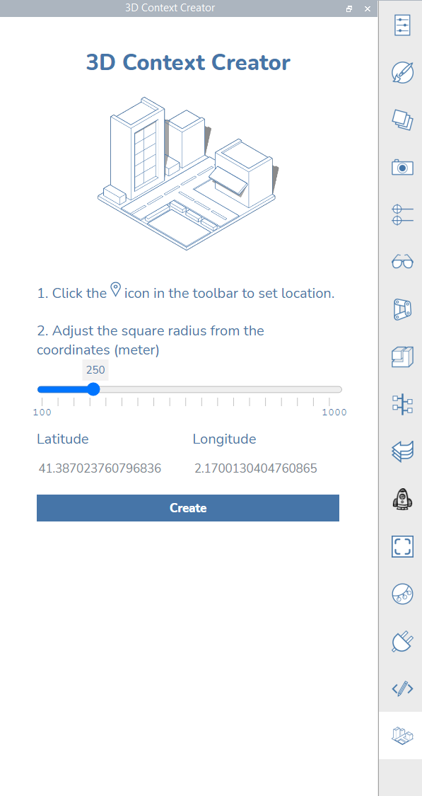

# 3D Context Creator

## What is it?

3D Context Creator is a very easy-to-use plugin that will help you quickly generate 3d context inside FormIt. This plugin can help you:

* Visualize your project site with its surrounding context
* Make informed decisions especially in the early stage of the design process.
* Is free for all users of FormIt to download.&#x20;

This plugin retrieves data from [Open Street Map](https://www.openstreetmap.org/about) to help transform it into FormIt geometries. The source code for this plugin is available on Github.&#x20;

## How to use it

To install the 3d Context Creator, open you Plugin Manager and paste this link into the input field: (1).png>)****

Once installed, the plugin can be found at the bottom of your plugin panel**:**

Before you generate the 3d context, set your site location from the toolbar

.png>)

Search for your site location, then click 'Import Satellite Image and Terrain'.

.png>)

Adjust the square radius (meters) of the context

.png>)

Click on the Create button. And that is it!

The plugin will take care of the rest and in a few moments.

## **Some examples**

Try to guess what iconic cities are represented in the following contexts:

.png>)

.png>)

.png>)

.png>)
