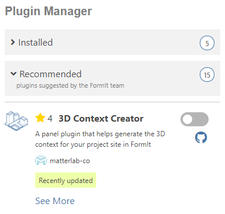
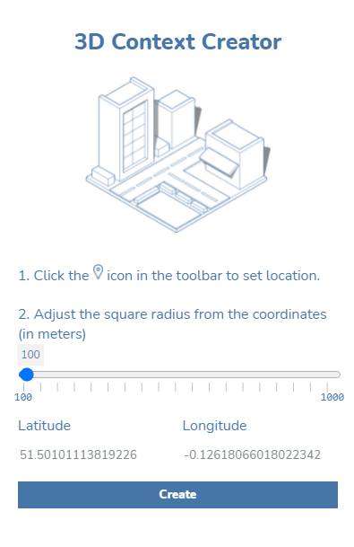
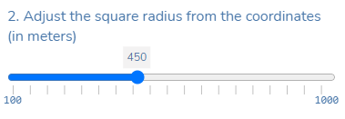

# 3D Context Creator

## What is it?

3D Context Creator is a very easy-to-use plugin that will help you quickly generate 3d context inside FormIt. This plugin can help you:

* Visualize your project site with its surrounding context
* Make informed decisions especially in the early stage of the design process.
* Is free for all users of FormIt to download.&#x20;

This plugin retrieves data from [Open Street Map](https://www.openstreetmap.org/about) to help transform it into FormIt geometries. The source code for this plugin is available on [Github](https://github.com/matterlab-co/FormIt-Context-Plugin).&#x20;

## How to use it

To install it, simply turn on the plugin’s toggle, as you would with any other plugin.

Once toggled on, the plugin should appear on the right side of the app and be ready to use.

Before using the plugin, begin by setting your site location from the main FormIt toolbar.

.png>)

Search for your site location, and then click Import Satellite Image and Terrain.

.png>)

Once the satellite image has been successfully imported into your FormIt project, navigate to the 3D Context Creator plugin.

Adjust the square radius slider to expand the distance (in meters) of the context from the location point.

Click on the Create button. And that is it!

Once you are happy with the settings, click the Create button. Depending on the size and complexity of the given radius, it may take a few moments to process the building forms.

## **Some examples**

Try to guess what iconic cities are represented in the following contexts:

.png>)

.png>)

.png>)

.png>)
