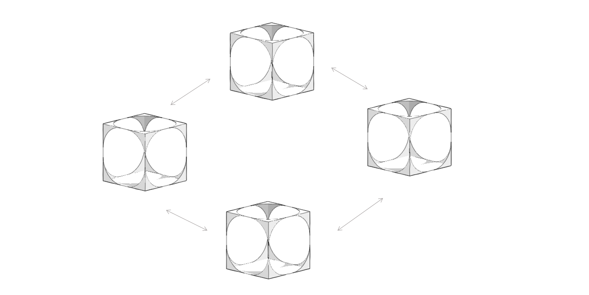

# Formit Plugin Community

## Looking for Plugins?

If you are looking for some ideas to develop your FormIt plugin, check out some of these examples:

* [Community plugins](https://github.com/topics/formit-plugin): Plugins developed by FormIt users and developers.
* [Plugins recommended by FormIt](https://github.com/search?q=org%3AFormIt3D+formit-plugin-recommended): Plugins developed by the community and recommended by FormIt team.
* [Plugins from FormIt](https://github.com/FormIt3D): Official Plugins developed by FormIt team.

## Want FormIt to feature your plugin?

If you have developed a plugin that would be useful for other FormIt users, we would love to hear more about it, so please let us know, we will review it and consider adding it **formit-plugin-recommended** list or feature it as [examples](./) in our primer.&#x20;

### Help from FormIt and the community

Having issues building or running plugins? [Reach out to us!](broken-reference)
