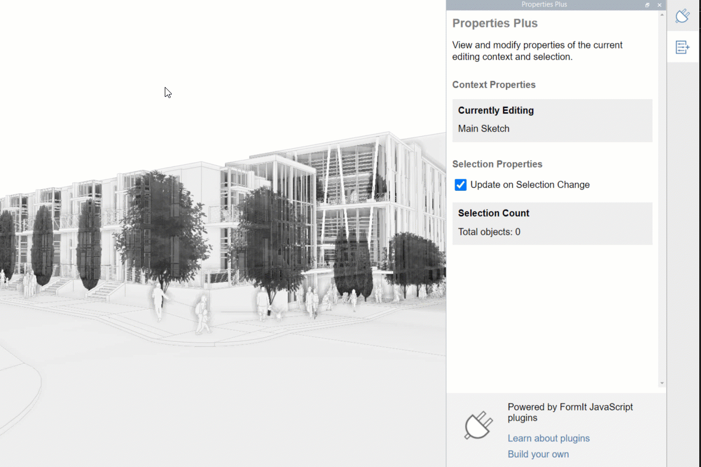

# How to Develop Plugins

For the tinkerers and developers out there, FormIt is a great tool for developing plugins. There are two modes of development you can choose from, depending on your development skills and the complexity of the project you wish to execute.&#x20;

* We recommend that you start with the [Your First Plugin](build-your-first-plugin/) section. It guides you through creating a simple plugin using the Plugin Playground.&#x20;
* If you want to develop a more complex project, we recommend following the [Advanced Development](advanced-development/) section.
* For information on developing other types of plugins, check out the [Additional Development Options](additional-development-options/) section.
* The [Tips and Tricks](tips-and-tricks/) section provides suggestions for improving your developer experience.

&#x20;
