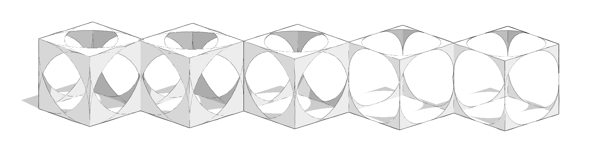

# Advanced Development

In the previous chapter, we covered the basics of plugin development by[ building your first plugin](../build-your-first-plugin/) in the plugin playground. This section will review some more advanced modes of development using an external IDE.

