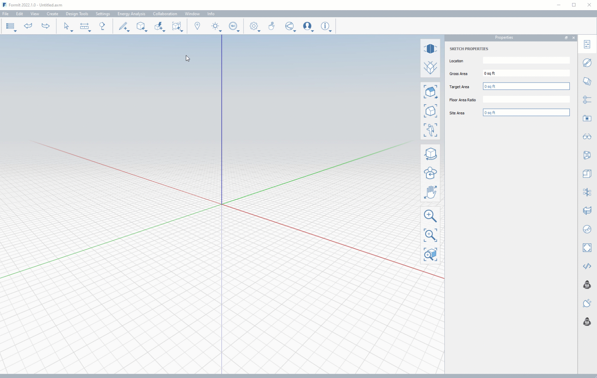
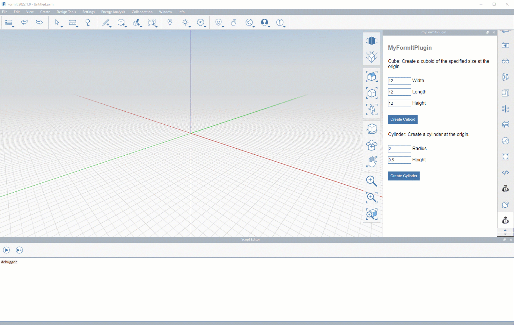
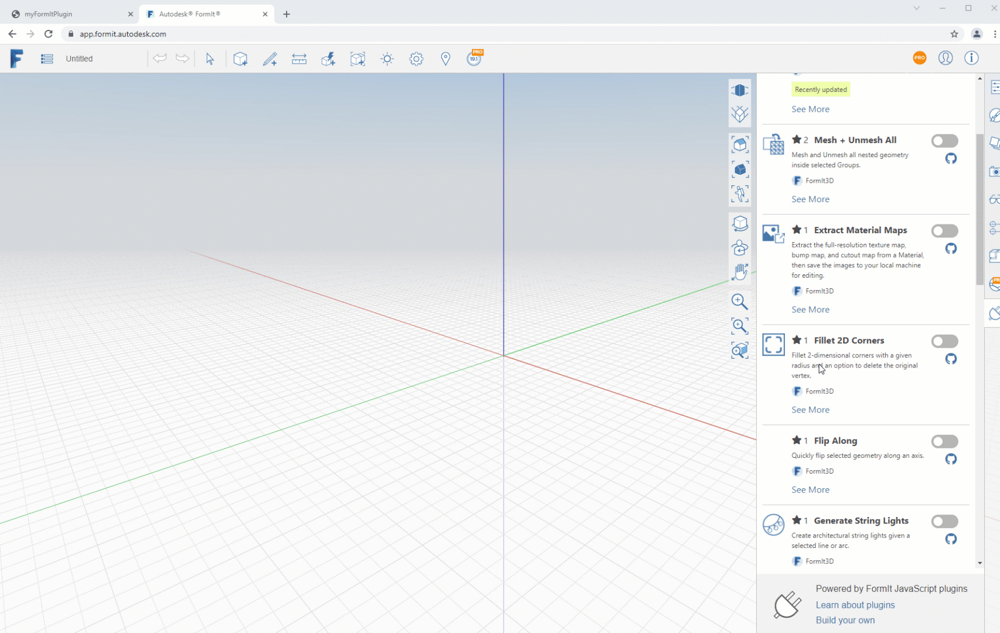

# Debugging

Debugging a FormIt plugin requires different procedures depending on the engine you are debugging. (For more information on engines check the [previous section](client-side-vs-web-side-engines.md))

### **Client-Side (FormIt) Debugging**

To debug in FormIt-side code, which applies to both toolbar- and panel-based plugins, you can add a line in the code to pop the desktop application's built-in JS debugger:

`debugger`

### **Web-Side (HTML) Debugging**

Panel-based FormIt plugins offer HTML-based UI debugging, since the panels are fundamentally HTML websites with styling and scripts.

To debug HTML-side code for plugins built into a panel, including scripts and styling:

* **FormIt for Windows 2021.1 and newer**
  * Right-click on the plugin HTML page and click "Debug" to display the application's built-in HTML debugger.

* **FormIt for Web**
  * Use shortcut F12, or Ctrl + Shift+ I, to pull up the browser's HTML debugger.

