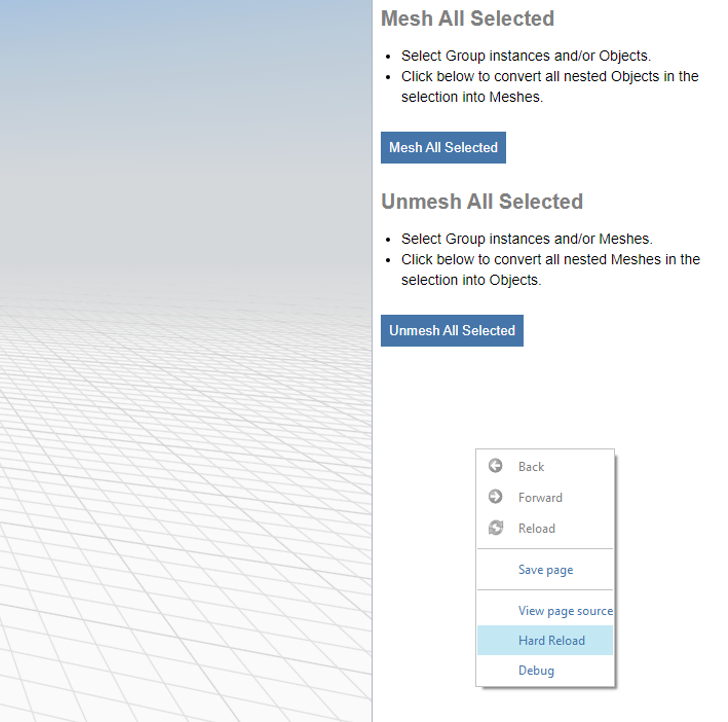

# Reloading for Local Changes

While developing a plugin you may need to quickly reload your latest code updates without reloading the whole app. This can be achieved in both web and windows versions of FormIt without reloading the whole app.

## Web Reloading

💡** **To reload your plugin in FormIt web right-click on the plugin's HTML and click on `Reload Frame`&#x20;

.png>)

## Windows Reloading

💡** **To reload your plugin in FormIt windows right-click on the plugin's HTML and click on `Hard Reload` &#x20;

