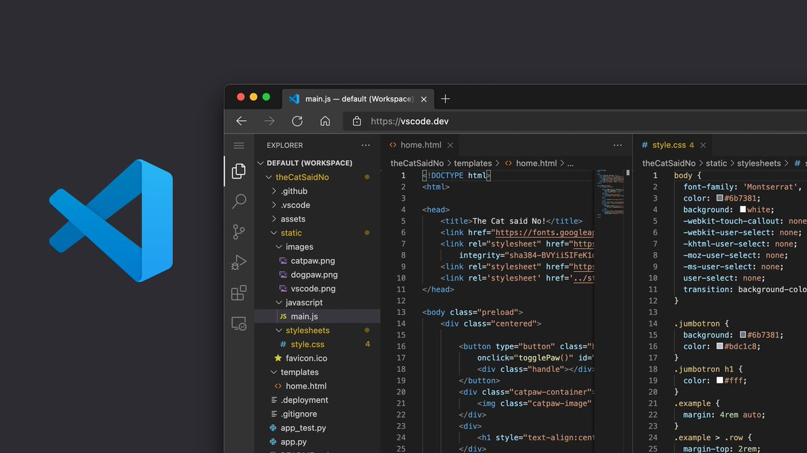

# Using an IDE

It is very simple and convenient to develop plugins inside the [Plugin Playground](../build-your-first-plugin/setting-the-plugin-playground.md). However, you may want to develop plugins using an external IDE. Some of the reasons for this are listed below:&#x20;

* You can use your preferred Integrated Development Environment (IDE) that may contain syntax error correction, extensions, etc.
* You can collaborate with colleagues on developing a FormIt plugin via a GitHub repository.
* You can develop private plugins and host them on a local server

### Install an IDE

You may use your preferred code editor, we will be using Visual Studio Code for this demonstration. Make sure your IDE includes a terminal for running your local server.

A free IDE that works well for FormIt plugin development is Microsoft's [Visual Studio Code](https://code.visualstudio.com/Download).

Follow the link to download the setup file and complete the installation.

