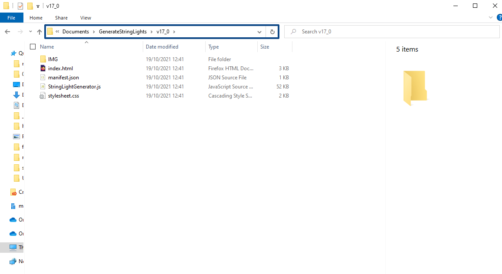
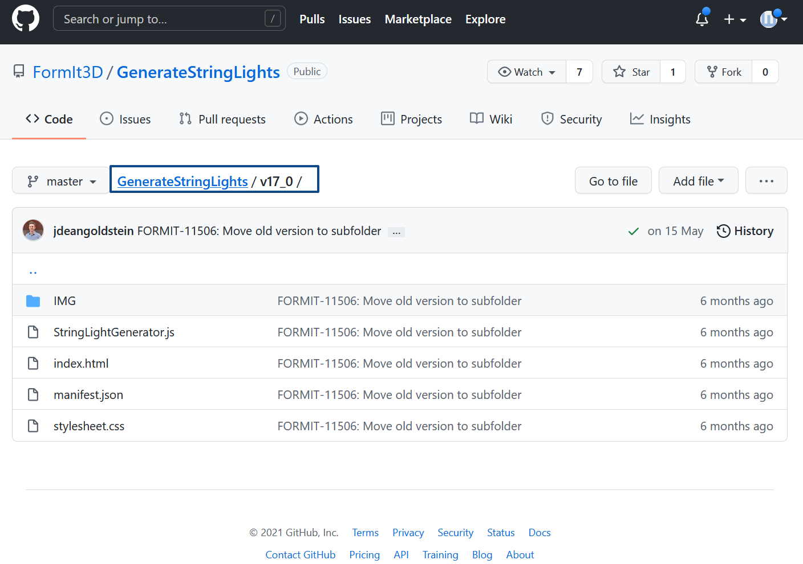
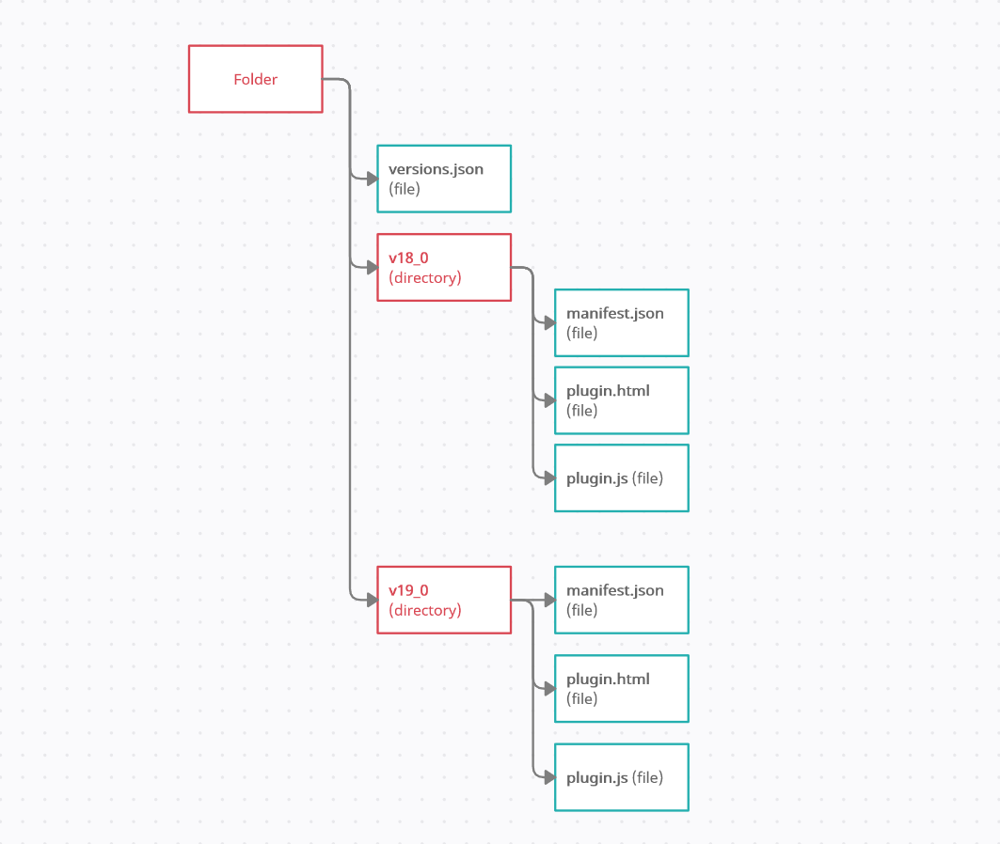

# Versioning

As you develop and update your plugin, at some point, you may need to version the code.

For example, FormIt's APIs may change between releases, and while you may want the new version of your plugin to use new FormIt or WSM APIs, you'd also like to keep the plugin working in older clients.

Starting with FormIt **v18.0**, you can implement versioning for your plugin in 3 simple steps:

* Add a _versions.json_ file to the root of your plugin directory
* Specify each compatible FormIt version, and the directory containing those plugin files, in _versions.json_
* Use the FormIt internal version number, or "Build Number", found in FormIt under Info > About.


### How to organize versioning for your plugin

Organize your plugin files and directories to match _versions.json_

Your _versions.json_ should look like this:

```
        [
            {
                "version":{
                    "major":18,
                    "minor":0
                },
                "path":"v18_0"
            },
            {
                "version":{
                    "major":19,
                    "minor":1
                },
                "path":"v19_0"
            }
        ]
        
```

The above paths _v18\_0_ and _v19\_0_ must be valid subpaths from the root of your directory/repository.







A great way to handle this is to move your plugin code into subdirectories. Using the above _versions.json_, a directory structure would look like this:

* **versions.json** (file)
*   **v18\_0** (directory)

    * **manifest.json** (file)
    * **plugin.html** (file)
    * **plugin.js** (file)


* **v19\_0** (directory)
  * **manifest.json** (file)
  * **plugin.html** (file)
  * **plugin.js** (file)

Optional properties on version are "exactVersion" and "lastVersion". "exactVersion" indicates the version has to match FormIt's version exactly. "lastVersion" indicates the last version allowed to run in FormIt.\


```
[
    {
      "version":{
        "major":18,
        "minor":0,
        "exactVersion":true
        },
        "path":"v18_0"
    },
    {
        "version":{
            "major":19,
            "minor":1,
            "lastVersion":true
       },
        "path":"v19_0"
    }
 ]
```

It's also possible to use git branches/tags/commits for your paths.

If you're working with a pre-release or beta build of FormIt, and would like to test changes to a plugin that only works with the pre-release version:

* Follow the steps above, except using the filename _versions\_prerelease.json_
* If you commit _versions\_prerelease_ to your repo, you'll want to remove it when that pre-release version of FormIt is released
  * Otherwise, future pre-release FormIt versions will be loading the plugin from a location that could be stale or intended for an older version
