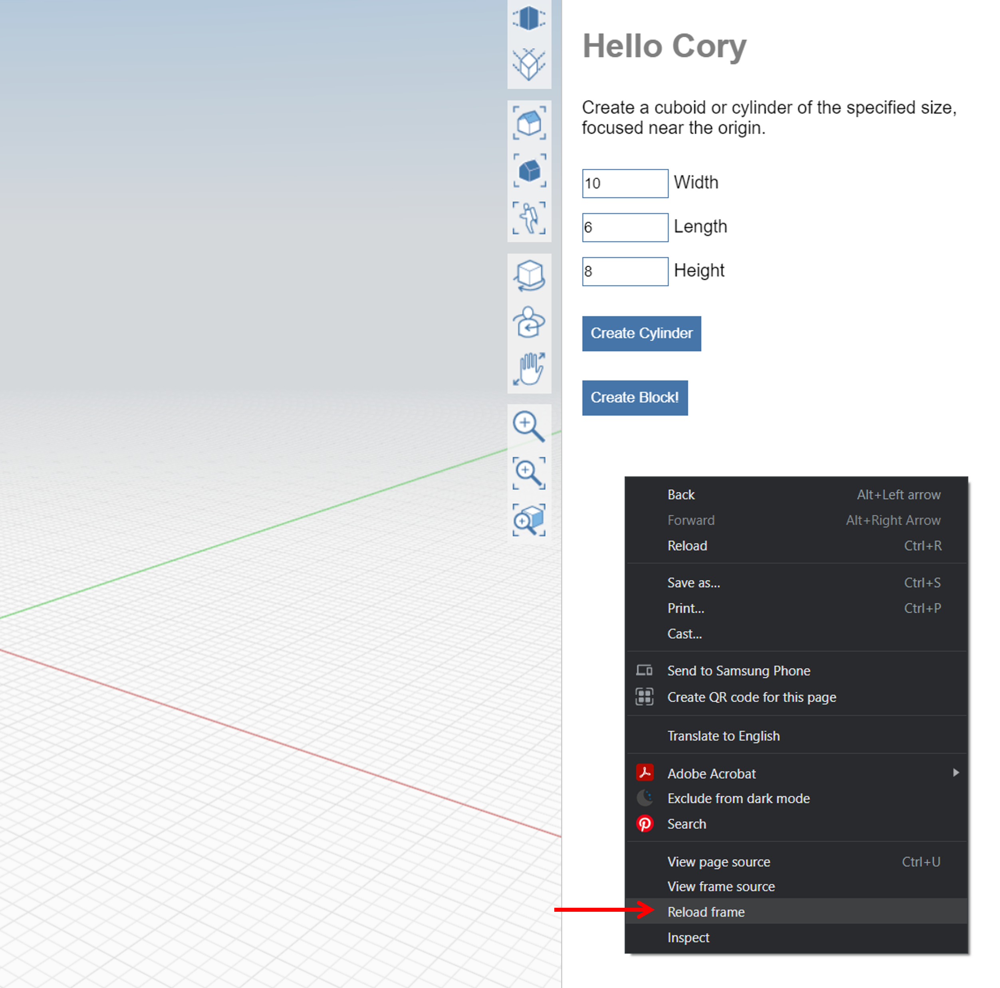

# Improve Performance

### Quick Reloading

💡** **You can reload a plugin on the web without reloading the whole app (same as in Windows) via right-clicking and selecting `Reload Frame`

**SECTION WILL CONTAIN INFORMATION INTO HOW TO  IMPROVE FORMIT'S PERFORMANCE**
