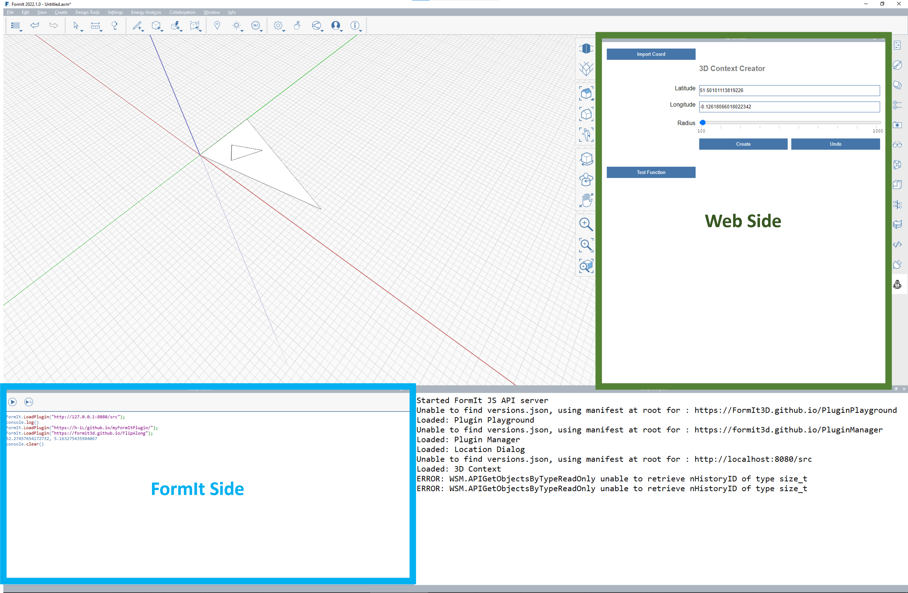

# Improve Performance

In order to improve performance, you may need to understand how FormIt's engine runs. Here is a little bit more information on how FormIt runs on FormIt's-side vs the web-side:

## **FormIt-Side vs Web-Side**

FormIt runs multiple JavaScript engines simultaneously:

* The FormIt application has its own JavaScript engine
* Each plugin Toolbar has its own JavaScript engine.
* Each plugin Panel has its own JavaScript engine (Chromium)

Plugins can specify where the JavaScript is loaded:



### FormIt-side:

Specified using [manifest.json](https://github.com/FormIt3D/FormItExamplePlugins/blob/master/HelloBlockAsync/v23\_0/manifest.json#L8)

```
    "Scripts": [
        "PLUGINLOCATION/blockFormItSide.js",
        "https://formit3d.github.io/FormItExamplePlugins/SharedPluginFiles/PluginUtils18_0.js"
    ]

```

### Web-side:

Specified using[ index.html](https://github.com/FormIt3D/FormItExamplePlugins/blob/master/HelloBlockAsync/v23\_0/index.html#L7)

Web Side scripts are loaded from the web page.&#x20;

Web Side scripts can call into the FormIt Side JavaScript using multiple async calls.

## Three methods to call FormIt-side commands from a Web-based plugin:

### Method 1: FormItInterface.CallMethod

`CallMethod `takes a function name and the arguments that will run on the FormIt Side.  The passed-in function will be called with the result of the function call.

```
    var args = {
        "w": 10,
        "l": 10,
        "h": 10
    }
    FormItInterface.CallMethod("CreateBlock", args, function(result)
    {
        // Result of the function call
    });
```

**Pros:**&#x20;

➕ No`await` needed.&#x20;

**Cons:**&#x20;

➖ A callback is needed to get the result and is called “who knows when”.&#x20;

➖ Scripts are defined in two different places.&#x20;

➖ Requires plugin logic to be split into two different files.

### **Method 2: FormIt.CallJS **

**\*Available in FormIt 2022.1 and newer only**

CallJS takes the JavaScript function to be called on the FormIt Side and the arguments json object.

```
var args =
{
    "w": 10,
    "l": 10,
    "h": 10
};
var result = await FormIt.CallJS("CreateBlock", args);

```

**Pros: **

➕ The result is available when needed

**Cons: **

➖** **Have to decorate all the async calls with await, forgetting to do so will mess things up.

➖** **Potentially slower due to `await`

### **Method 3 (async/await)**

```
const pt1 = await WSM.Geom.Point3d(0,0,0);
```

With an async call, the Web Side calls the FormIt Side. This call starts in one process, sent to another process, then the result is passed back to the starting process. This is why await is needed.&#x20;

Only built-in FormIt APIs can be called by default.

**Pros: **

➕ The result is available when needed.&#x20;

➕ Allows combining all code into one JS file run from the web side, with no scripts defined in manifest.json.

**Cons: **

➖** **Have to decorate all the async calls with `await`, forgetting to do so will mess things up.&#x20;

➖** **Potentially slower due to` await.`

### Method 4 (RegisterAsyncAPI)&#x20;

**\*Available in FormIt 2023.0 and newer only **

To call a user defined function on the FormIt Side, the function needs to be registered. For example:&#x20;

**FormIt Side**

```
FormIt.RegisterAsyncAPI("HelloBlockAsync", "CreateBlock", "l, w, h");
// CreateBlock runs from FormIt.
HelloBlockAsync.CreateBlock = function(args)
{
    return { "Result" : "It Worked!!"};
}
```

**Web Side**

```
var result = await HelloBlockAsync.CreateBlock(l, w, h);
```

See [HelloBlockAsync](https://github.com/FormIt3D/FormItExamplePlugins/tree/master/HelloBlockAsync/v23\_0)  for an example.

**Pros: **

➕ The result is available when needed.&#x20;

➕ Allows combining all code into one JS file run from the web side, with no scripts defined in manifest.json.

**Cons: **

➖** **Have to decorate all the async calls with await, forgetting to do so will mess things up.&#x20;

➖** **Potentially slower due to await.

##
