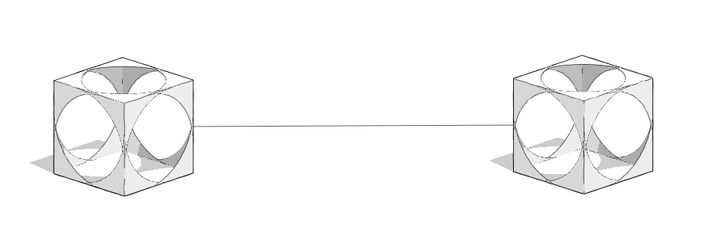

# Useful Links

## FormIt API

To access FormIt's API documentation use the following links:

* [FormIt Core JS API](https://formit3d.github.io/FormItExamplePlugins/docs/FormItJSAPI/group\_\_mod\_\_jsapi\_\_formit.html)
* [FormIt Modeling Kernel (WSM) JS API](https://formit3d.github.io/FormItExamplePlugins/docs/FormItJSAPI/group\_\_mod\_\_jsapi\_\_wsm.html)
* [FormIt Core C++ API](https://formit3d.github.io/FormItExamplePlugins/docs/FormItCPPAPI/index.html)
* [FormIt Modeling Kernel C++ API](https://formit3d.github.io/FormItExamplePlugins/docs/FormItCPPAPI/group\_\_mod\_\_wsm\_\_api\_\_ref.html)

