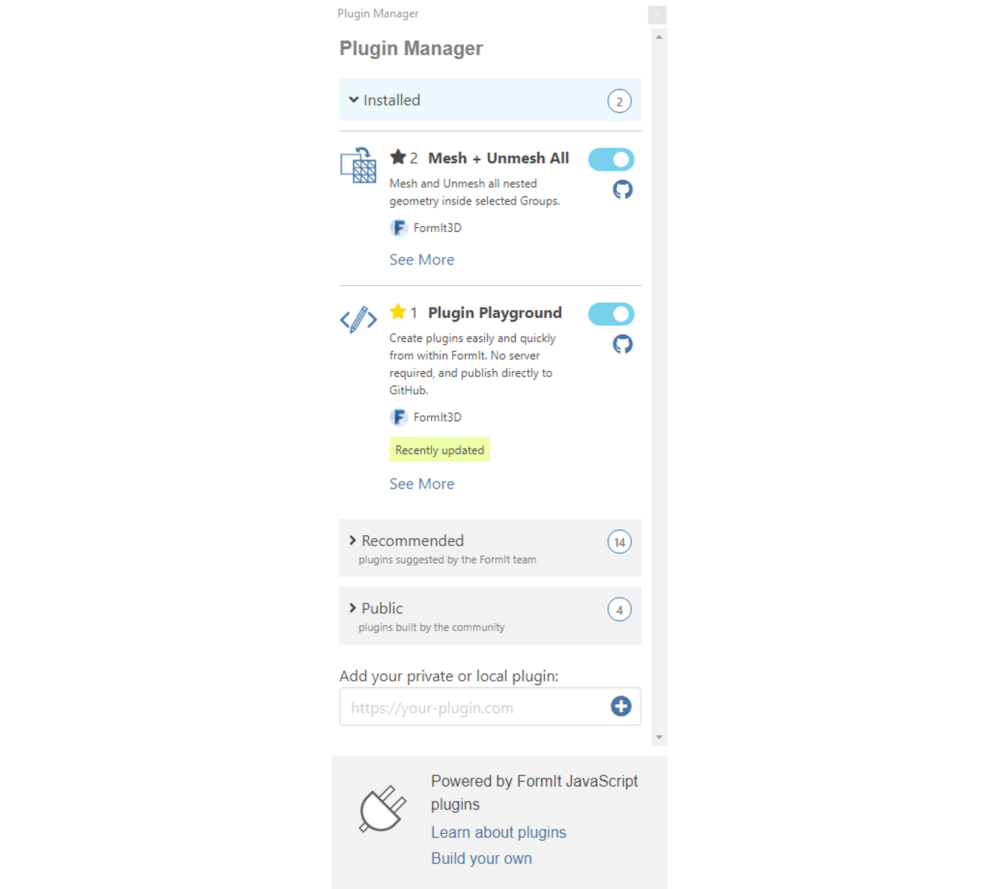

# How to Use Plugins

.gif>)

## Plugin Manager

The FormIt Plugin Manager is your one-stop shop for discovering and managing plugins.

The Plugin Manager is loaded automatically when FormIt starts, as long as FormIt has access to the internet.

Access it by clicking its tab icon on the right side of the app:

## Plugin Categories

The Plugin Manager organizes plugins into categories to help you find the plugins you're most interested in.

**Installed Plugins: **Plugins already installed by the user.&#x20;

**Recommended Plugins:** Plugins that the FormIt team recommends for expanding FormIt's core functionality and unlocking new workflows. Community-developed plugins appear here after being approved by the FormIt team. More details to come on this in the future.

**Public Plugins:** Plugins built by the community. Plugins in this category have not been reviewed or approved by the FormIt team.

## Add Your Private or Local Plugin

If you're [developing your own plugin](https://formit3d.github.io/FormItExamplePlugins/docs/HowToBuild.html), you can add its private URL into the field at the bottom of the panel and click (+):

For more information on adding your private or local plugin, see [Previewing a Plugin in the Plugin Manager. ](how-to-develop-plug-ins/advanced-development/previewing-a-plugin-in-the-plugin-manager.md)

## Resetting the Plugin Manager

The Plugin Manager uses registry keys on Windows to store your installed repositories and plugins. If you need to reset your Plugin Manager to its defaults, delete the following registry key:

`Computer\HKEY_CURRENT_USER\Software\Autodesk\FormIt 360\Plugins`

⚠️ Note: This will uninstall all user-added repos and plugins, resetting the Plugin Manager to include only the built-in repos and plugins.

## Installing Plugins

The [Plugin Manager](broken-reference) includes a number of plugins, organized under different categories. Each plugin has a name, description, GitHub link, and Install toggle.&#x20;

To install a plugin, simply turn on the toggle next to the plugin's name.&#x20;

The icon of the selected plugin will appear in the right panel. Click it to display the plugin's UI.

## Using Plugins

Each plugin has a unique UI defined by its developer. A plugin usually has a set of instructions on how to use it, a set of parameters (text boxes, sliders, checkboxes, etc.), and one or more buttons to execute it.

As an example, we'll use one of the simpler examples in the Plugin Manager: Fillet 2D Corners. We first load the plugin from the Recommended section of the Plugin Manager. Then, following the instructions provided by the developer, we set the fillet radius, select a group of faces to fillet, and click the Fillet Corners button.

##

