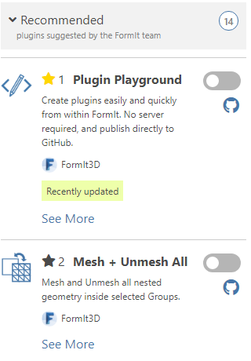
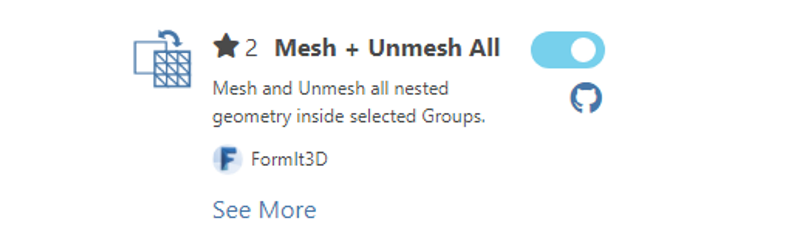
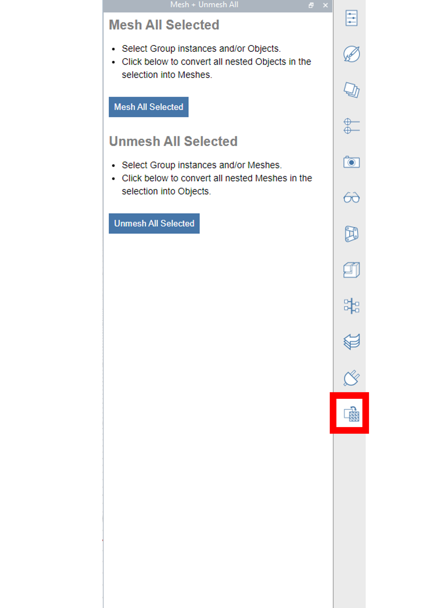

# Installing Plugins

The [Plugin Manager](the-plugin-manager.md) includes a number of plugins, organized under different categories. Each plugin has a name, description, GitHub link, and Install toggle.&#x20;

To install a plugin, simply turn on the toggle next to the plugin's name.&#x20;

The icon of the selected plugin will appear in the right panel. Click it to display the plugin's UI.

##

