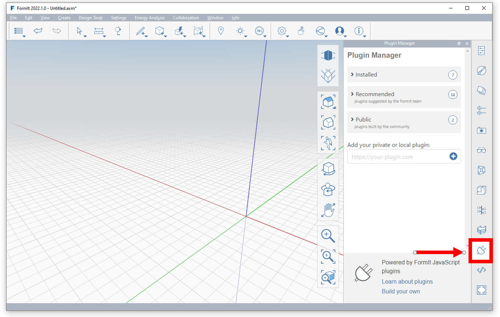
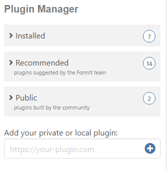
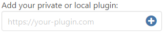

# Plugin Manager

The FormIt Plugin Manager is your one-stop shop for discovering and managing plugins.

The Plugin Manager is loaded automatically when FormIt starts, as long as FormIt has access to the internet.

Access it by clicking its tab icon on the right side of the app:

## The Plugin Manager's Window

The Plugin Manager organizes plugins into categories outlining each number of plugins in each category.&#x20;

.PNG>)

## Plugin Categories&#x20;

The 3 different categories are:

**Installed Plugins: **Plugins already installed by the user.&#x20;

**Recommended Plugins:** Plugins that the FormIt team recommends to expand FormIt's core functionality and unlock new workflows. Community-developed plugins will appear here after being approved by the FormIt team. More details to come on this in the future.

**Public Plugins:** Plugins built by the community, but which have not been reviewed or approved by the FormIt team.

## Add Your Private Local Plugin

If you're [developing your own plugin](https://formit3d.github.io/FormItExamplePlugins/docs/HowToBuild.html), you can add its private URL into the field at the bottom and hit (+):

For more information on adding your private local plugin, refer to the following section: [Previewing your Plugin With the Plugin Manager ](../how-to-develop-plug-ins/advanced/deployment/previewing-a-plugin-in-the-plugin-manager.md)
