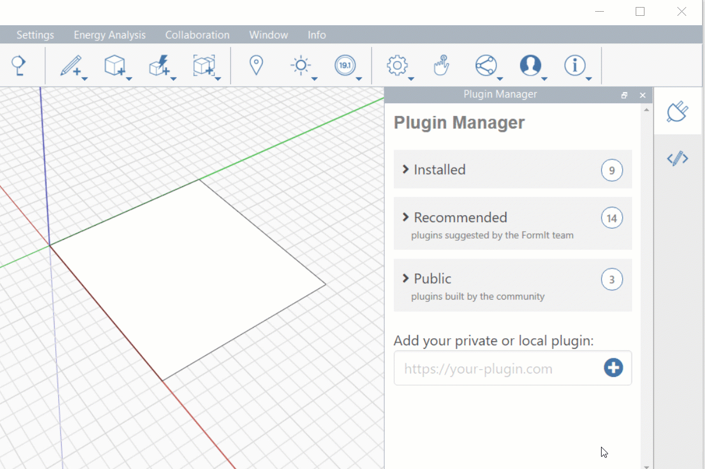

# Using Plugins

Each plugin has a unique UI defined by its developer. A plugin usually has a set of instructions on how to use it, a set of parameters (text boxes, sliders, checkboxes, etc.), and one or more buttons to execute it.

As an example, we'll use one of the simpler examples in the Plugin Manager: Fillet 2D Corners. We first load the plugin from the Recommended section of the Plugin Manager. Then, following the instructions provided by the developer, we set the fillet radius, select a group of faces to fillet, and click the Fillet Corners button.

