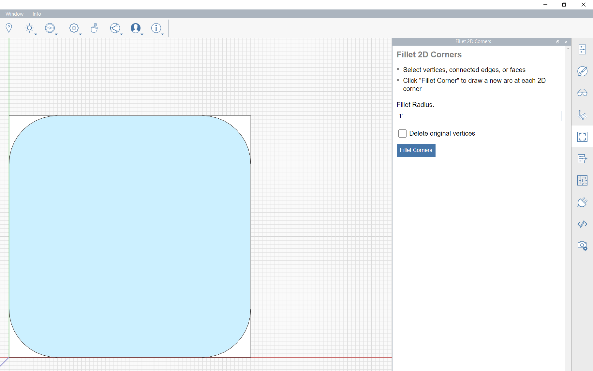

# Using a Basic Plugin

Each plugin will have a unique UI according to what the developer considers necessary. A plugin will usually have some set of instructions or observations, a set of inputs that can vary from text boxes, sliders, checkboxes etc. and one or more buttons to execute the plugin.

To use one of the simpler examples on the plugin manager we will use the Fillet 2D Corners. Following the instructions provided by the developer, we must set the fillet radius, then select a group of faces to fillet, and finally, click on the Fillet Corners button.

