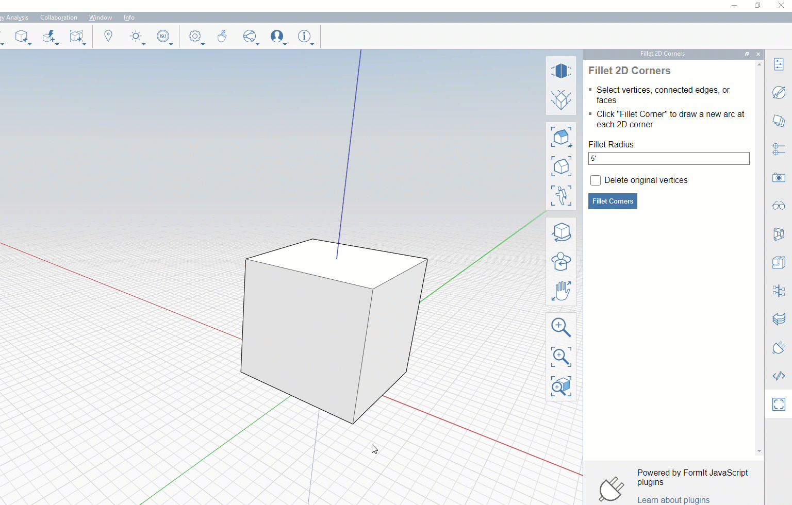

# Introduction to Plugins

## What Are Plugins?

 Plug-ins are additions that expand FormIt's core functionality. Created to help enhance/empower/simplify the modeling process, productivity, or workflow when 3d modeling in FormIt. Plug-ins can be used for generating objects, making modifications or extracting info & properties of an object. Features of plug-ins may be as simple as fillet 2 edges, or as advance as generating a string of light fixtures. You may find plug-ins developed by the communities or Autodesk from GitHub. You may even create your own plug-ins to suit the needs of different project.

## Where are they available?

They are available both on desktop or web version, as long as you have an internet connection. You can find them on the [plugin manager](how-to-use-plug-ins/the-plugin-manager.md)

**(DIFFERENCES BETWEEN DESKTOP AND WEB?)** 

## Is it open source?

Plugins are open source.....Lorem ipsum dolor sit amet, consectetur adipiscing elit, sed do eiusmod tempor incididunt ut labore et dolore magna aliqua. Ut enim ad minim veniam, quis nostrud exercitation ullamco laboris nisi ut aliquip ex ea commodo consequat. Duis aute irure dolor in reprehenderit in voluptate velit esse cillum dolore eu fugiat nulla pariatur. Excepteur sint occaecat cupidatat non proident, sunt in culpa qui officia deserunt mollit anim id est laborum.

**(LICENSE MORE INFO?)**

## Connectivity to services

Talk about connectivity to different services.

**(WHICH ONES SHOULD WE TALK ABOUT?)**

## **Using Formit Plugins for Concept Modeling** 

Are you a developer looking for a concept modeling environment? If you are interested in developing plug-ins go to the following section on[ how to develop plugins](how-to-develop-plug-ins.md)

**(ADD SPECIFIC SECTION ABOUT CONCEPT MODELING)**

## Need help with formit plugins?

Drop us a line on the [Autodesk forums](https://forums.autodesk.com/t5/formit-forum/bd-p/142)

 
