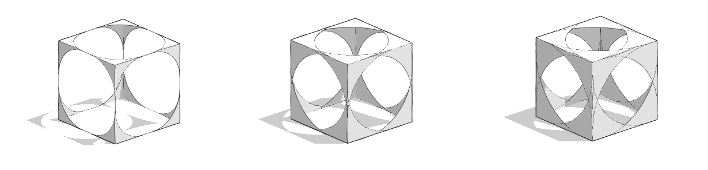

# Introduction to Plugins

If you are thinking about using Plugins, here is some basic information you may want to know:

* [What Are Plugins?](introduction/what-are-plugins.md)
* [Where Are Plugins Available?](introduction/where-are-they-available.md)
* [Are Plugins Open Source?](introduction/are-plugins-open-source.md)
* [How Do I Connect to Other Services?](introduction/how-do-i-connect-to-other-services.md)
* [How to Contact Us if You Need Any Help?](introduction/how-to-contact-us.md)

****

&#x20;
