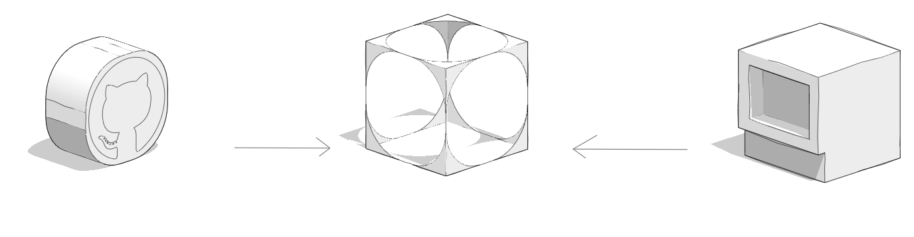

# Where Are They Available?

Plugins are comprised of a series of files and folders hosted on GitHub, or on a local server when building your own. They are available both on desktop or web version, as long as you have an internet connection on the [plugin manager](../how-to-use-plug-ins/the-plugin-manager.md)

## Plugins and Internet Connection

External plugins (plugins not hosted locally) require an internet connection to initially load, which means:

* External plugins will not load if no internet connection is detected when FormIt starts. Once loaded, some external plugins can continue to work in offline mode for that session, but others might break until connectivity is restored.&#x20;
* External plugins load the latest code on the server at every run, so their functionality will update whenever the author pushes a change. Plugins are loaded asynchronously, which means the order of the plugins in the FormIt interface may change with each new session.&#x20;

## Resetting the Plugin Manager

The Plugin Manager uses registry keys on Windows to store your installed repositories and plugins. If you need to reset your Plugin Manager to its defaults, delete the following registry key:

`Computer\HKEY_CURRENT_USER\Software\Autodesk\FormIt 360\Plugins`

⚠️ Note this will uninstall all user-added repos and plugins, resetting the Plugin Manager to include only the built-in repos and plugins.
