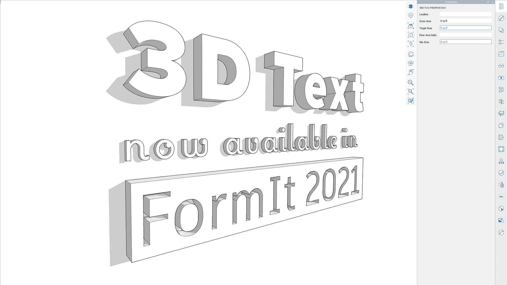

# 3D Text

## Optimisé par Dynamo

Dans FormIt 2021 et les versions ultérieures, vous pouvez générer et modifier des objets 3D Text, qui sont optimisés par Dynamo. Dynamo permet de modifier la police, la taille et d’autres propriétés du texte en place, sans avoir à générer et à repositionner le texte lorsque des modifications sont nécessaires.

## Placement de texte 3D

* Accédez au groupe de fonctions Dynamo dans FormIt pour Windows et vérifiez que vous vous trouvez dans le répertoire Dynamo Samples.
* Cliquez sur l’exemple 3D Text.
* Déplacez le curseur sur la zone de dessin. Le titre 3D Text s’affiche sur le curseur.
   * Avant de placer le texte, déplacez le curseur sur la géométrie afin de modifier l’orientation du texte 3D, par exemple sur une surface verticale pour que le texte s’aligne verticalement. Vous pouvez également appuyer sur la touche Tab pour passer d’une orientation à l’autre.
* Cliquez pour placer le texte 3D, qui est généré dans un groupe FormIt.
* Une fois le placement effectué, le groupe de fonctions Properties s’affiche afin de dévoiler les options de 3D Text disponibles.

## Itération en place

L’intérêt de Dynamo pour générer du texte 3D est qu’il permet de le modifier facilement, et conserve le texte dans sa position actuelle, afin de l’itérer rapidement.

Les options de 3D Text sont disponibles dans le groupe de fonctions Properties lorsque le groupe 3D Text est sélectionné ou lors de la modification du groupe.

Après avoir placé le groupe 3D Text, le groupe de fonctions Properties s’affiche automatiquement. Vous pouvez également sélectionner le groupe et passer vous-même à Propriétés, ou double-cliquer sur le groupe pour passer automatiquement au groupe de fonctions Properties.

### Text

Saisissez le texte que vous souhaitez afficher dans la géométrie du texte 3D. Ce champ affiche également un aperçu de la police et de la justification sélectionnées. Appuyez sur Entrée/Retour afin de créer plusieurs lignes.

### Font

Sélectionnez la police du texte 3D. Cette liste affiche les polices disponibles sur l’ordinateur et la sélection d’une nouvelle police met à jour le champ Text.

Notez que certaines polices ont une géométrie plus complexe et peuvent prendre plus de temps à se générer à l’aide de Dynamo.

### Justification

Le texte sera alors aligné par rapport à l’origine du système de coordonnées local du groupe.

* L’option Left permet de s’assurer que le texte commence à l’origine du groupe et se développe vers la droite.
* L’option Center permet de s’assurer que le texte est toujours centré sur l’origine du groupe.
* L’option Right permet de s’assurer que le texte se termine à l’origine du groupe.

### Text Size

Hauteur du texte, exprimée dans l’unité FormIt active.

### Extrusion Depth

Quantité d’extrusion 3D du texte, exprimée dans les unités FormIt actives. Le texte 3D est conçu pour être un solide. Par conséquent, cette valeur ne peut pas être égale à zéro, mais vous pouvez l’approcher de 0 pour que l’extrusion paraisse moins évidente.

### Tracking

Le suivi est utile pour ajuster l’espacement par défaut entre les lettres d’une police particulière. Ce paramètre utilise les unités FormIt actives et peut être positif ou négatif. Par exemple, en pieds, 0,25 ajoute 3” d’espacement entre chaque lettre. À l’inverse, -0,25 rapproche toutes les lettres de 3”.

### Multi-Line Spacing

Si le champ Text contient plusieurs lignes, cette valeur détermine l’espace entre chaque ligne de texte. Ce paramètre utilise les unités FormIt actives.

### Invert Text

Lorsque la valeur est définie sur True, cette option crée un solide autour du texte et en supprime le texte, afin d’obtenir un texte « inversé », comme si le texte était découpé dans un matériau.

### Inverted Text Border

Ce paramètre s’applique uniquement lorsque l’option Invert Text est définie sur True. Il indique l’épaisseur de la bordure autour du texte pour le solide duquel le texte est supprimé. Ce paramètre utilise les unités FormIt actives.

### Curve Faceting Quality

Étant donné que les courbes provenant de polices sont converties en segments de ligne à l’aide de 3D Text, cette valeur contrôle la précision des facettes des courbes.

Des valeurs inférieures réduisent le niveau de détails des facettes \(segments plus longs\), tandis que des valeurs plus élevées augmentent le niveau de détail des facettes \(segments plus courts\). Cette valeur remplace les paramètres de création de facettes de courbe et de surface de FormIt dans les préférences.

### Run

Après avoir modifié les options, cliquez sur le bouton « Run » pour exécuter le graphique Dynamo sous-jacent et générer de nouveaux résultats. Ce bouton devient bleu lorsque les paramètres ont été modifiés. Vous devez donc cliquer sur « Run » pour afficher les mises à jour dans la géométrie finale.‌

### Edit Embedded Graph

Cliquez sur ce bouton pour lancer l’environnement de l’éditeur graphique Dynamo. Celui-ci vous permet d’afficher et de modifier le graphique Dynamo sous-jacent afin de modifier rapidement les paramètres et d’afficher les mises à jour en direct, ou d’inspecter/ajuster la logique. Cette opération n’est pas obligatoire, mais peut être utile pour résoudre des problèmes ou accélérer les modifications. Pour en savoir plus, reportez-vous aux sections ci-dessous.

## Itération plus rapide dans Dynamo

Si vous effectuez une itération des options de 3D Text, il est recommandé de lancer l’éditeur graphique Dynamo afin d’ajuster les paramètres et d’afficher les modifications en temps réel. Cela vous permet également d’examiner la logique derrière le graphique, en cas de problème.

Pour lancer l’éditeur graphique Dynamo, cliquez sur le bouton « Edit Embedded Graph » dans le groupe de fonctions Properties pour lancer l’éditeur graphique Dynamo.

## Dépannage

3D Text utilise Dynamo en arrière-plan et Dynamo utilise un noyau de modélisation appelé ASM afin de générer sa géométrie, qui est renvoyée à FormIt.

Certaines polices peuvent créer des « courbes auto-sécantes » ou d’autres géométries problématiques, ce qui entraîne des erreurs dans ASM.

Si vous obtenez une erreur lorsque vous tentez d’exécuter 3D Text ou si des lettres disparaissent, cliquez sur « Edit Embedded Graph » pour déceler les erreurs dans le graphique et la source du problème.

Certaines polices présentent également des problèmes connus qui empêchent leur conversion en géométrie correcte. Bahnschrift en est un exemple. Si vous rencontrez un autre problème de police, [faites-le nous savoir sur les forums](https://forums.autodesk.com/t5/formit-forum/bd-p/142?profile.language=fr). Nous ferons notre possible pour résoudre les problèmes liés à des polices spécifiques.

