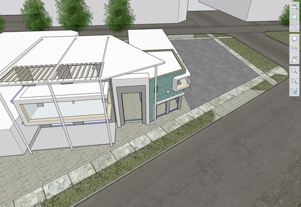

# Alinear cámara con cara

Alinee rápidamente la cámara para mirar directamente a cualquier cara.

Seleccione una sola cara y, a continuación, haga clic con el botón derecho para acceder al menú contextual. Busque Alinear cámara con cara en la parte superior del menú o utilice el método abreviado AF:

