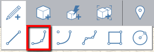
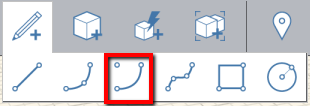
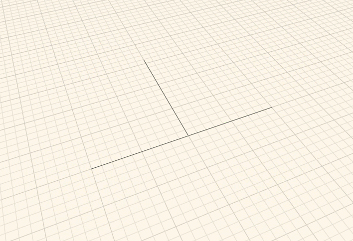

# Arc

Use the Arc tool to create half circles or symmetrical arcs. There are two ways to create arcs.

## Arc by Three Points

An arc is defined by three points and can be draw on the X, Y, and Z axes. Define your first point then determine a distance from the first to the second point and finally a third point for the height of the arc. You will automatically be provided a 'half-circle' point which you can snap to; beyond this, the arc line will extend past the first two points.

You can see the length between the first point and the second point as you're determining the second points next location; to manually specify a length, simply enter a value and a dimension box will appear.

After drawing the arc, you can make a face using the [Line tool](line-tool.md) to connect the first and second points.

## Arc by Center

Choose the mid point of the arc, then drag to choose the center, and drag to define the length of the arc. Simply start typing a value to enter a precise number of degrees for the arc.

