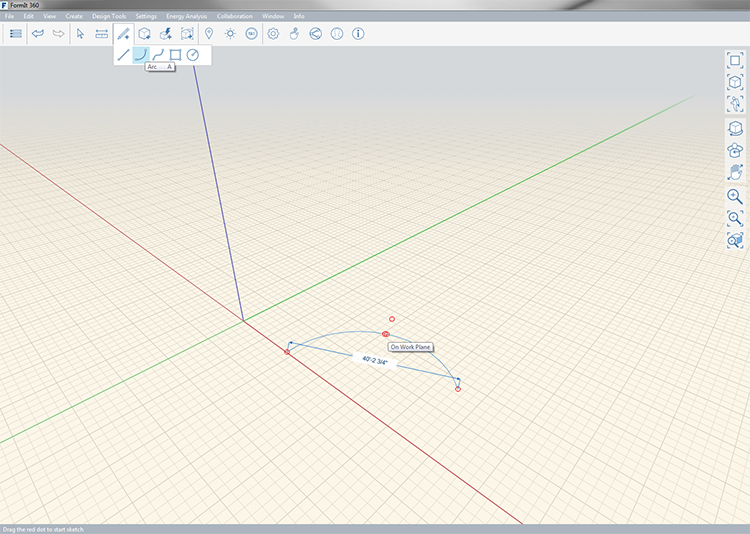
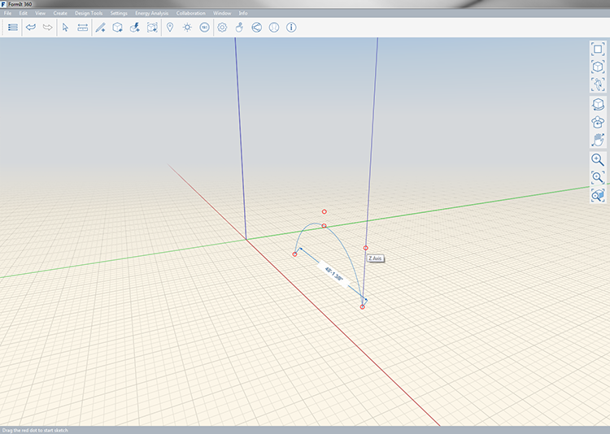

### Arc Tool

---
> Use the arc tool to create half circles or symetrical arcs.

---

An arc is defined by three points and can be draw on the X, Y and Z axes. Define your first point then determine a distance from the first to the second point and finally a third point for the height of the arc. You will automatically be provided a 'half-circle' point which you can snap to; beyond this the arc line will extend past the first two points.

You can see the length between the first point and the second point as you're determining the second points next location; to manually specify a length press **tab**. 

After drawing the arc You can make a face by then using the [line tool](../tool-library/line-tool.md) to connected point 1 and point 2.

