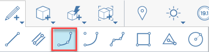
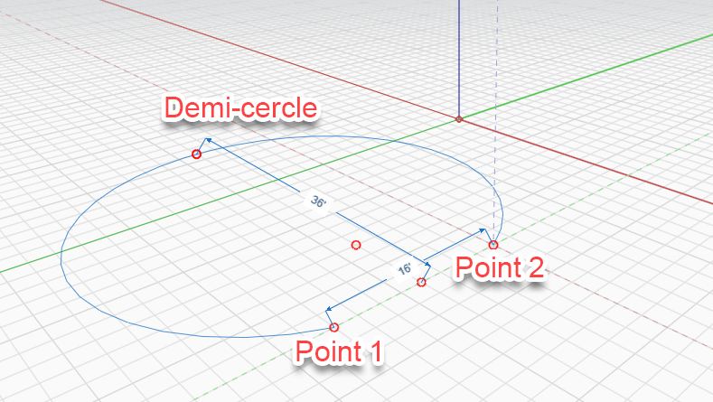
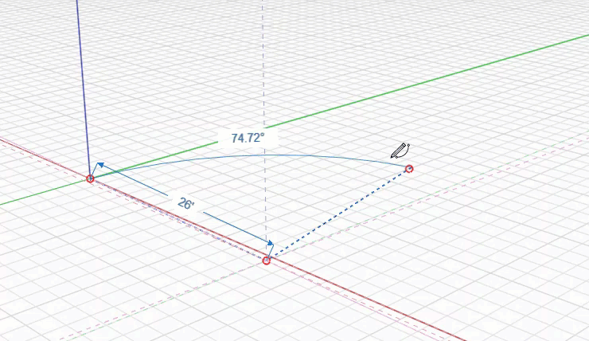

# 弧

使用「弧」工具建立半圓或對稱弧。建立弧的方法有兩種。

## 用三個點畫弧

弧由三點定義，可以在 X、Y 和 Z 軸上繪製。定義第一點，然後決定第一點到第二點的距離，最後決定第三點得到弧的高度。系統會自動為您提供一個可鎖點的「半圓」點；除此之外，弧線將延伸通過前兩個點。

在決定下一個位置的第二點時，您可以看到第一點與第二點之間的長度；若要手動指定長度，只需輸入值，就會顯示尺寸方塊。

繪製弧後，您可以使用[直線工具](line-tool.md)連接第一點和第二點來建立一個面。

## 用中心畫弧

選擇弧的中點，然後拖曳以選擇中心點，再拖曳以定義弧的長度。只需開始鍵入值，即可輸入弧的精確度數。

