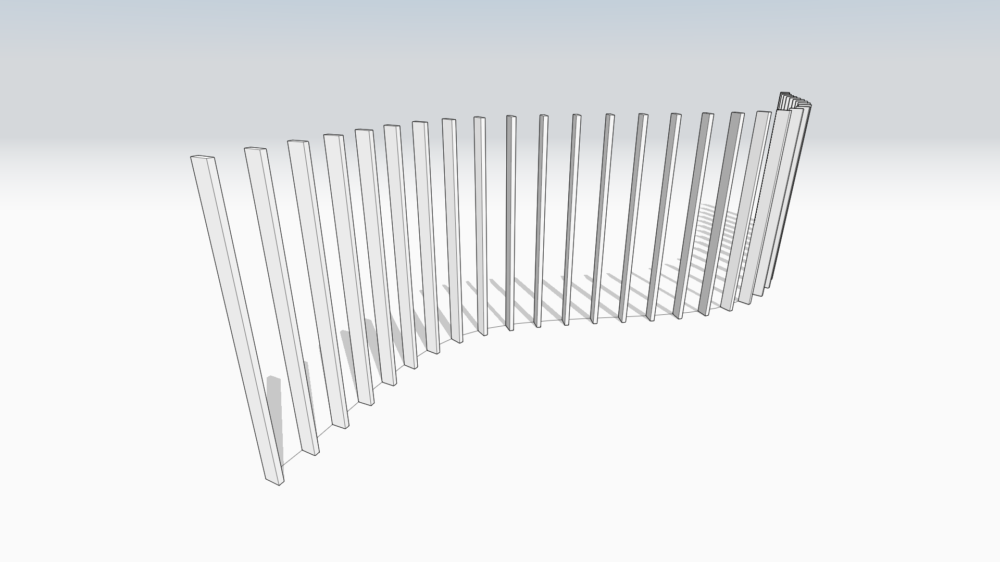

# Array Along Path

## Powered by Dynamo

In FormIt 2021 and newer, you can array objects along a path, and quickly customize the results in-place. Array Along Path is powered by Dynamo, which means the array is easily configurable to get the results you want, and re-running the logic will update the geometry in-place.

## Starting Array Along Path

* Go to the Dynamo panel in FormIt for Windows, and ensure you're in the Dynamo Samples directory
* Click the Array Along Path sample
* On the left side of the screen, you'll see a prompt to "Select object\(s\) to array."
  * You can select any mix of FormIt objects for this step.
  * Once you've got something selected, you can hit the "next" arrow on the left side of the screen, or just hit Enter.
* Now you'll see a prompt to "Select path for array."
  * Here, you should select only a series of contiguous edges, or a Group containing a series of contiguous edges.
  * Once you've got the path selected, click the "finish" button, or hit Enter. 
* The Dynamo panel will indicate it's processing the changes. When it's done, you'll have a Dynamo-generated Array in a FormIt Group, ready for modifying \(see below\).

## Iterating In Place

After running Array Along Path, you'll see its results are set to default values, so you'll want to modify them to suit your needs. 

When Array Along Path runs, it creates a new Group containing the results, and FormIt will automatically select the Group and show the available options for that Array Along Path instance. 

You can always return to the Array Along Path properties by selecting the Group and switching to the Properties panel, or by editing the Group which will automatically show Properties.

### Select Object\(s\) to Array 

Click this to go back to the selection wizard to change which objects are being arrayed.

### Select Array Path

Click this to go back to the selection wizard to change the path that is used to calculate the array.

### Array Type 

This toggles the type of array to calculate: By Distance, or By Number.

**When true**, the calculation will be "By Distance", so the number below refers to the distance between copies.

**When false**, the calculation will by "By Number of Copies", so the number below this field refers to the number of copies to fit along the path.

### Include Original Selection In Results

When **true**:

* The object\(s\) selected will be counted as one of the new copies
* The resulting Dynamo Group will include the original selection in its results, so the new copies will Z-fight with the original selection. You can put the original selection on a [Layer](layers.md), and turn it off to hide it.

When **false**:

* The resulting array will **not** include the original selection, so you'll get the number of copies you specified **in addition to** the original selection, and the results won't Z-fight

### Rotate Copies Along Path

When **true**, the copies are rotated to maintain the orientation of the original object relative to the path.

When **false**, the copies are not rotated, only moved.

### Use Relative Positioning Along Path

When **true**:

* Each copy will maintain the distance between the path and the original object.
* If the original object is **not** positioned at one of the path endpoints, the largest remaining segment of the path will be used for the array calculation. 

When **false**:

* The entire length of the path will used to calculate the array, regardless of where the original object is relative to the path. 
* This decouples the path's location relative to the object, and simply uses the entire path. Useful if the path and object are not near each other.

### Reverse Path Direction

For closed paths only. When using Array Along Path with a closed path, the direction of the curve may unexpectedly flip the expected results of the array. Toggle this to **true** to reverse the array direction if the results are flipped.

### Run 

After editing the options, click the "Run" button to run the underlying Dynamo graph, and generate new results. This button will turn blue when parameters have changed, so you know that "Run" needs to be clicked to see the updates in the final geometry.‌

### Edit Embedded Graph 

Clicking this will launch the Dynamo graph editor environment, so you can view and edit the underlying Dynamo graph to more quickly change parameters and see live updates, or to inspect/adjust the logic.

## Selecting Geometry

When selecting objects for Array Along Path, and other selection-based Dynamo graphs:

* You can select any mix of FormIt objects - vertices, edges, faces, solids, Groups, and Meshes. 
  * Note that depending on the step, some of these objects should not be selected.
  * For example, when selecting the path, you should only select a contiguous series of edges, or a Group containing a contiguous series of edges. Anything else will cause the graph to fail.
* You can double-click on an object to select everything attached. 
* You can use the area selection window to grab a series of objects.
* You can select objects already selected to deselect them.
* At least one object is required to proceed with a selection-based step.

