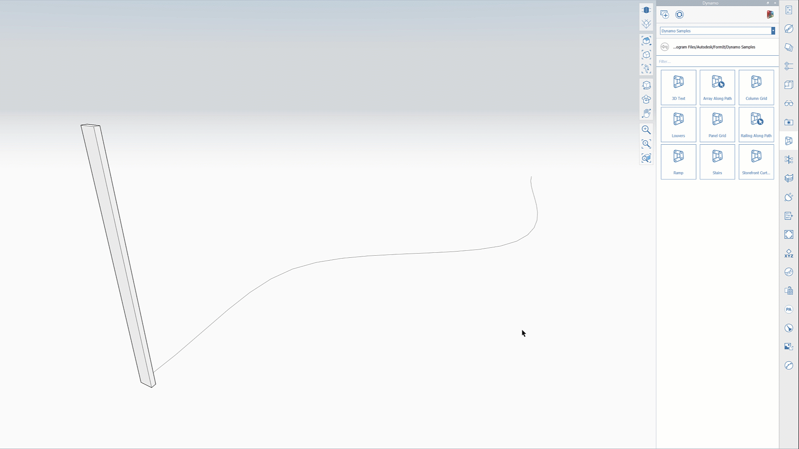
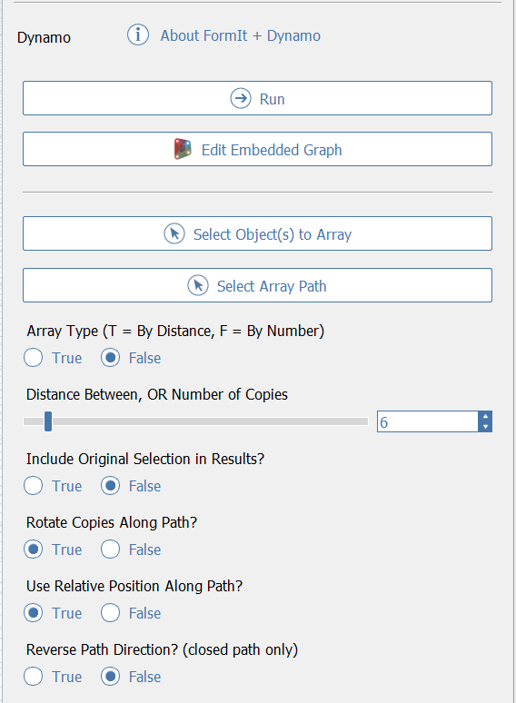

# Array Along Path

## Технологии Dynamo

В FormIt 2021 и более поздних версиях можно создавать объекты массива по траектории и быстро настраивать результаты. Для команды «Array Along Path» (массив по траектории) применяются технологии Dynamo. Это означает, что массив легко настроить для получения требуемых результатов, а повторный запуск логики приводит к обновлению доступной геометрии.

## Создание массива по траектории

* Перейдите на панель Dynamo в FormIt для Windows и откройте каталог примеров Dynamo.
* Щелкните пример «Array Along Path».
* В левой части экрана отобразится запрос «Select object\(s\) to array» (выберите объекты для создания массива).
   * На этом этапе можно выбрать любые объекты FormIt.
   * Выбрав нужный объект, нажмите стрелку «Next» (далее) в левой части экрана или просто клавишу ENTER.
* Отобразится запрос «Select path for array» (выберите траекторию размещения массива).
   * Здесь следует выбирать только ряд смежных кромок или группу, содержащую ряд смежных кромок.
   * Выбрав траекторию, нажмите кнопку «Finish» (готово) или клавишу ENTER.
* На панели Dynamo появится информация об обработке изменений. По завершении обработки в группе FormIt появится созданный в Dynamo массив, который можно изменять \(см. ниже\).

## Итерация на месте

Результаты выполнения команды «Array Along Path» имеют значения по умолчанию. Их можно изменить по необходимости.

При выполнении команды «Array Along Path» создается новая группа с результатами. В FormIt будет автоматически выбрана эта группа, и отобразятся доступные параметры данного экземпляра массива по траектории.

Можно в любой момент вернуться к свойствам массива по траектории. Для этого следует выбрать группу и открыть панель свойств либо начать редактировать группу, и тогда свойства отобразятся автоматически.

### Select Object\(s\) to Array 

Нажмите эту кнопку, чтобы вернуться в мастер выбора и изменить объекты, которые необходимо добавить в массив.

### Select Array Path

Нажмите эту кнопку, чтобы вернуться в мастер выбора и изменить траекторию, используемую для расчета массива.

### Array Type 

Изменяет тип массива для расчета: By Distance (по расстоянию) или By Number (по количеству).

**Если значение «True»**, расчет выполняется по расстоянию, поэтому указанное ниже число будет означать расстояние между копиями.

**Если значение «False»**, расчет выполняется по количеству копий («By Number of Copies»), поэтому число под этим полем будет означать количество копий, которое необходимо вписать в траекторию.

### Include Original Selection In Results

Если значение **True**:

* Выбранные объекты будут считаться одной из новых копий.
* В результате полученная группа Dynamo будет содержать исходный набор, поэтому между новыми копиями и исходным набором объектов будут возникать Z-конфликты. Можно поместить исходный набор объектов на [слой](layers.md) и скрыть, отключив его.

Если значение **False**:

* В полученный массив **не будет включен** исходный набор объектов, поэтому в результате вы получите указанное количество копий **в дополнение** к исходному набору при отсутствии Z-конфликтов.

### Rotate Copies Along Path

Если значение **True**, копии поворачиваются с сохранением ориентации исходного объекта относительно траектории.

Если значение **False**, копии не поворачиваются, а только перемещаются.

### Use Relative Positioning Along Path

Если значение **True**:

* каждая копия сохраняет расстояние между траекторией и исходным объектом.
* Если исходный объект **не расположен** в одной из конечных точек траектории, то для расчета массива используется наибольший оставшийся сегмент траектории.

Если значение **False**:

* для расчета массива используется вся длина траектории независимо от расположения исходного объекта относительно траектории.
* Это позволяет отделить местоположение траектории относительно объекта и просто использовать всю траекторию. Данный параметр используется, если траектория и объект расположены далеко друг от друга.

### Reverse Path Direction

Только для замкнутых траекторий. При использовании команды «Array Along Path» с замкнутой траекторией направление кривой может неожиданно зеркально отобразить предполагаемые результаты массива. Установите значение **True**, чтобы изменить направление массива в случае зеркального отображения результатов.

### Run 

Завершив редактирование параметров, нажмите кнопку «Run», чтобы запустить основной график Dynamo и создать новые результаты. После изменения параметров эта кнопка выделяется синим цветом. Это свидетельствует о том, что ее необходимо нажать для просмотра обновлений в итоговой геометрии.‌

### Edit Embedded Graph 

По нажатию этой кнопки открывается среда редактора графика Dynamo, в которой можно просматривать и редактировать основные графики Dynamo для быстрого изменения параметров и просмотра обновлений в режиме реального времени, а также для проверки и корректировки логики.

## Выбор геометрии

При выборе объектов для массива по траектории и других графиков Dynamo по выбранным объектам выполните следующие действия.

* Можно выбрать любой набор объектов FormIt: вершины, кромки, грани, тела, группы и сети.
   * Обратите внимание, что в зависимости от этапа не следует выбирать некоторые из этих объектов.
   * Например, при выборе траектории можно выбрать только ряд смежных кромок или группу, содержащую ряд смежных кромок. При выборе любых других объектов возникнет ошибка графика.
* Дважды щелкните объект, чтобы выбрать все присоединенные элементы.
* Окно выбора области можно использовать для захвата нескольких объектов.
* Можно нажать на уже выбранные объекты, чтобы отменить их выбор.
* Для выполнения действия с выбранными элементами требуется выбрать хотя бы один объект.

