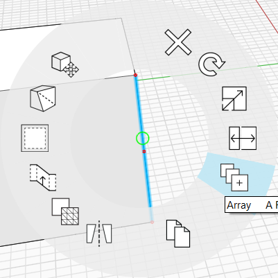
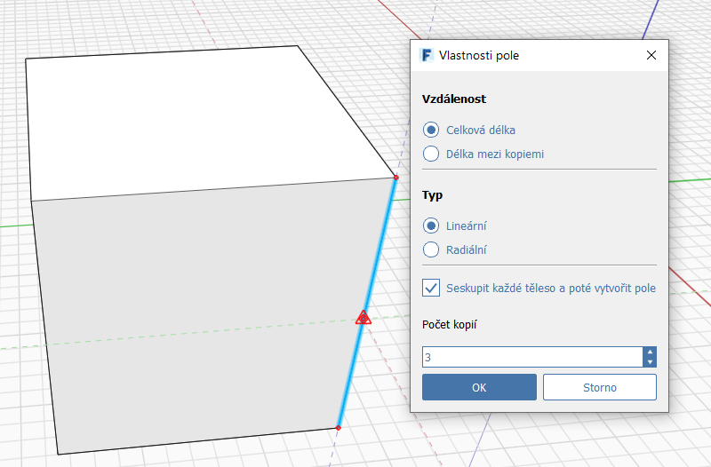
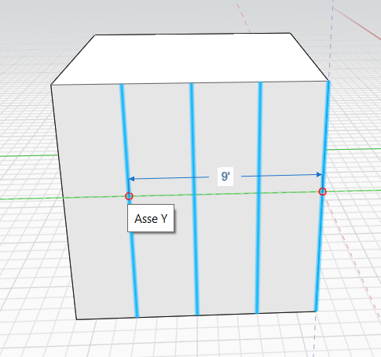
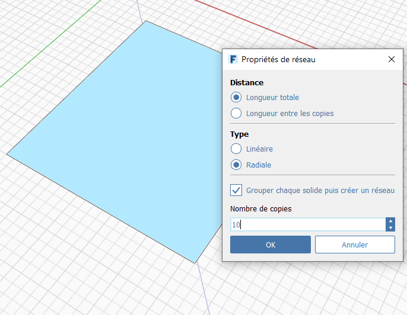
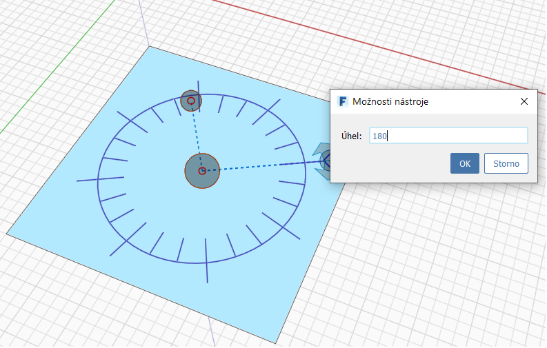
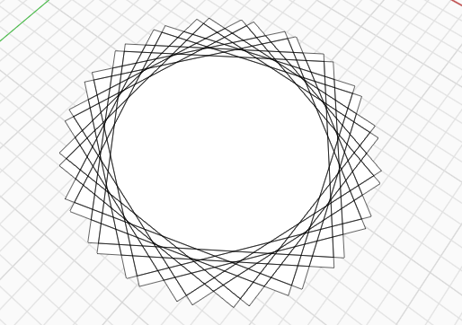

# 配列

FormIt では、直線配列と放射状配列の両方を作成できます。**エッジ、面、またはオブジェクト全体に配列を作成する**には、コンテキスト メニューの[配列]アイコンをクリックします。次に、[直線]または[放射状]を選択し、他のパラメータを指定してオブジェクトをクリックすると、配列が開始されます。再度クリックして配列要素を配置します。

## 直線

  
  

## 放射状

  
  

