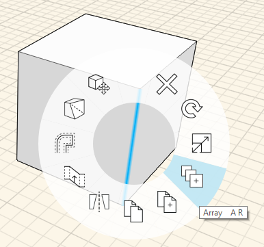
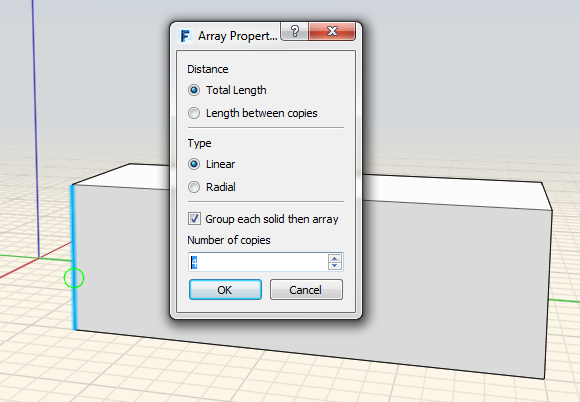
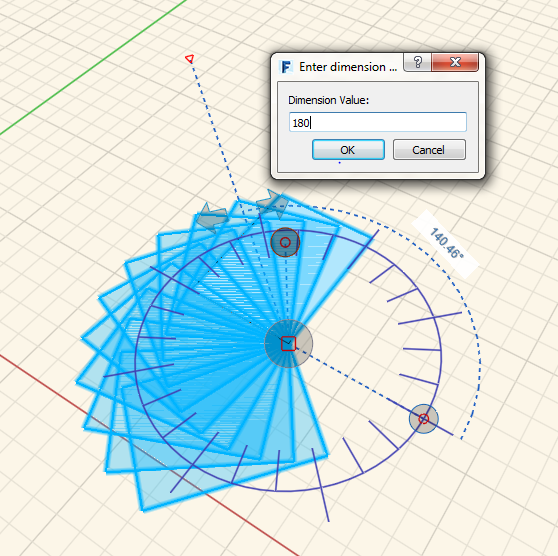
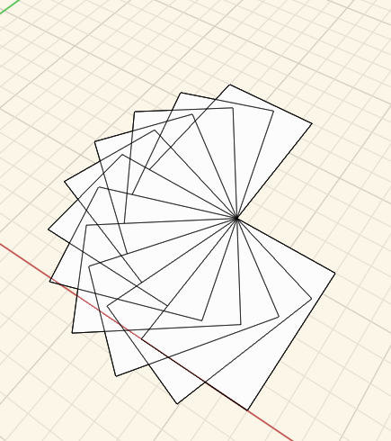

# Array

You can create both linear and radial arrays in FormIt. To **array edges, faces, or entire objects**, click on the Array icon from the Context Menu. Next, choose Linear or Radial, specify the other parameters, and click the object to start an array. Click again to place the arrayed elements.

## Linear

  
  

## Radial

  
  

