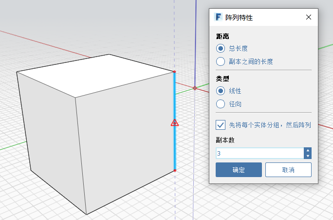
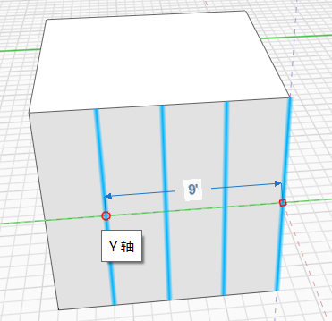

# Pole

V aplikaci FormIt můžete vytvořit lineární i radiální pole. Chcete-li **vytvořit pole hran, ploch nebo celých objektů**, klikněte v místní nabídce na ikonu Pole. Dále vyberte možnost Lineární nebo Radiální, zadejte další parametry a kliknutím na objekt vytvořte pole. Dalším kliknutím umístěte prvky pole.

## Lineární

  
  

## Radiální

  
  

