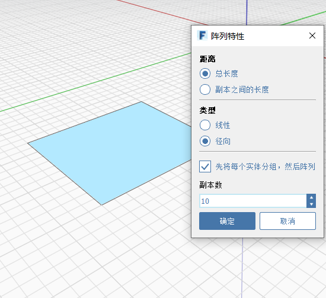

# Matrice

È possibile creare matrici lineari e radiali in FormIt. Per **creare una matrice di bordi, superfici o interi oggetti**, fare clic sull'icona Matrice dal menu contestuale. Quindi, scegliere Lineare o Radiale, specificare gli altri parametri, quindi fare clic sull'oggetto per avviare una matrice. Fare nuovamente clic per posizionare gli elementi creati con la matrice.

## Lineare

  
  

## Radiale

  
  

