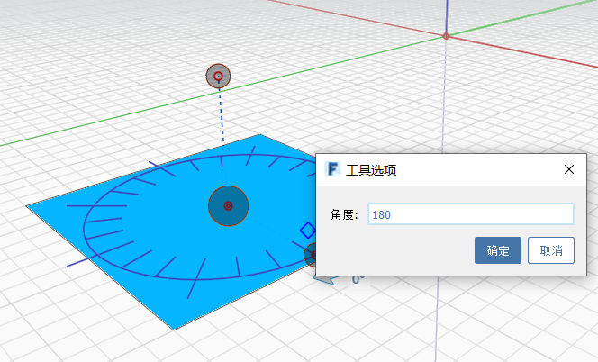

# Szyk

W programie FormIt można tworzyć szyki liniowe i promieniowe. Aby **ustawić w szyku krawędzie, powierzchnie lub całe obiekty**, kliknij ikonę Szyk w menu kontekstowym. Następnie wybierz opcję Liniowe lub Promieniowe, określ inne parametry i kliknij obiekt, aby rozpocząć szyk. Kliknij ponownie, aby umieścić elementy w szyku.

## Liniowy

  
  

## Promieniowy

  
  

