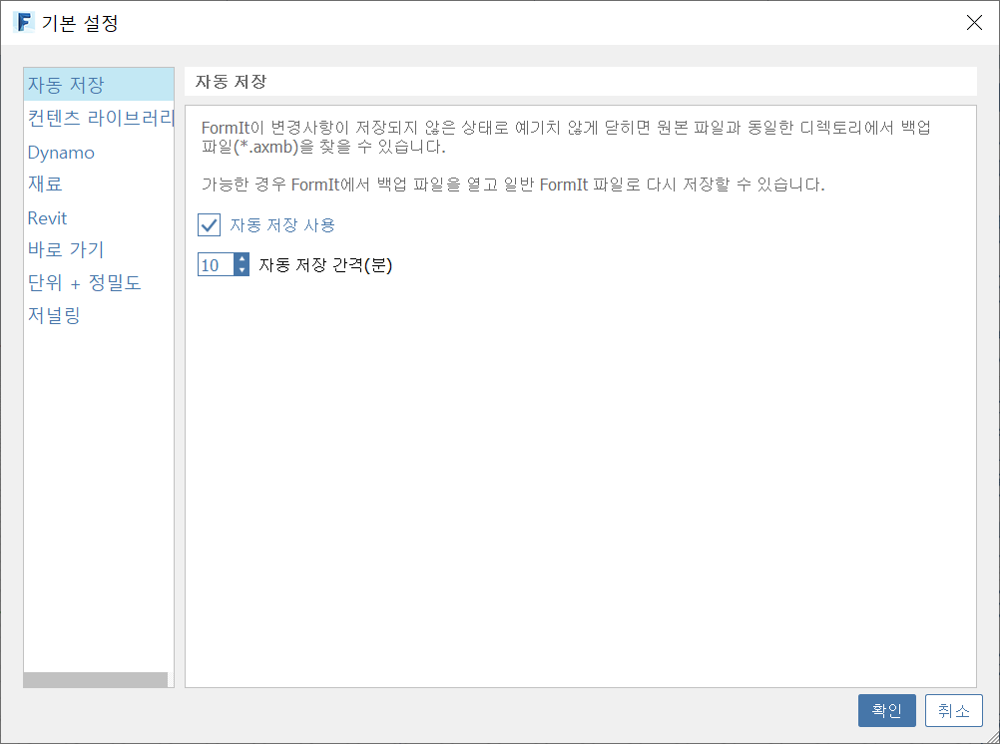

# AutoSave

Starting with v17.3, FormIt for Windows includes AutoSave, which makes a backup copy of your FormIt model while you work. This backup file can be used to recover data if FormIt closes with unsaved changes.

### Toggling AutoSave

Find configuration options for AutoSave in Edit &gt; Preferences &gt; AutoSave.

AutoSave is enabled by default, but can be disabled entirely by simply unchecking the box. 

Set the interval \(in minutes\) at which AutoSave will make a backup copy by entering a value in the "AutoSave interval" number box.

Note that these preferences are application-level, and will not change when opening different files.

### How AutoSave Works

When AutoSave is enabled, it will determine whether the current FormIt file has unsaved changes, and if so, it will create a backup copy of the file at the specified interval.

Backup files are stored next to the original file, and have an extension of `.axmb`.

For example, if your original FormIt file is stored at `C:/Users/<user>/FormIt/MyProject.axm`, the backup file can be found at `C:/Users/<user>/FormIt/MyProject.axmb`.

If you start a new FormIt session \(without opening a file,\) unsaved changes can be found at `C:/Users/<user>/Documents/Untitled.axmb`. Once you save the new model to a different location, the backup will start saving unsaved changes next to the new location, as noted above.

When you save changes to the original file, AutoSave will automatically delete the backup file, since the backup is now older than the original file. However, making subsequent changes to the saved file will again prompt AutoSave to start backing up at the specified interval.

If the file has unsaved changes, and you close FormIt without electing to save, the backup file will remain - just in case those unsaved changes were important. Similarly, if FormIt is forced to close - either through a computer shutdown or an application crash - the AutoSave backup file will not be deleted, and can be used later to recover data.

### Working With AutoSave Enabled

FormIt minimizes the potential performance impact of AutoSave by executing the backup in a separate process. With small- to medium-sized files, you shouldn't notice when AutoSave backs up. With very large files \(~400MB and above\), you might notice just a momentary pause while FormIt copies the entire model and starts backing up in a separate process.

If you're wondering if AutoSave is currently backing up, you can watch the status bar the bottom left of the application for a brief "AutoSaving..." message:

If your status bar is disabled, you can enable it at Window &gt; Status Bar or via shortcut HS.

### Recovering Data with AutoSave

When opening a FormIt file with a backup available, FormIt will alert you that the backup file exists. As mentioned above, this could be simply due to you closing FormIt without electing to save changes to this project last time it was edited, or due to FormIt unexpectedly closing.

Clicking the "Open it?" hyperlink will load the `.axmb` backup file.

Similarly, you can use File &gt; Open, and manually select the `.axmb` file from the file explorer to open a backup.

Once the backup file is open, the next time you save, FormIt will require you to pick a different FormIt file \(`.axm`\) to overwrite. You cannot overwrite FormIt backup files \(`.axmb`\).

