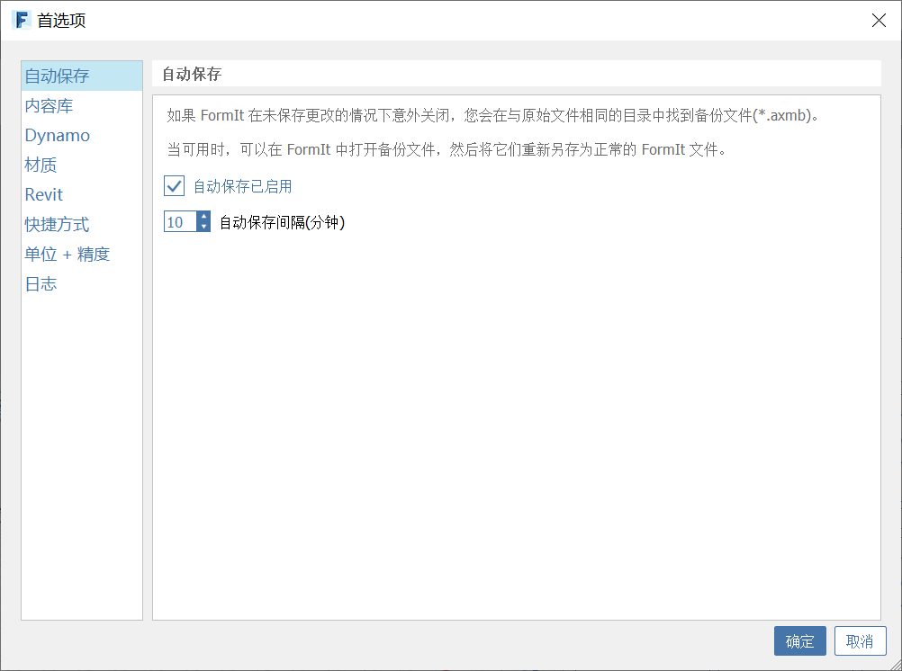

# Automatické ukládání

Počínaje verzí 17.3 zahrnuje aplikace FormIt pro systém Windows funkci automatického ukládání, která během práce vytváří záložní kopii modelu aplikace FormIt. Tento záložní soubor lze použít k obnovení dat, pokud se aplikace FormIt ukončí s neuloženými změnami.

### Přepínání automatického ukládání

Možnosti konfigurace funkce Automatické ukládání najdete v nabídce Úpravy &gt; Předvolby &gt; Automatické ukládání.

Automatické ukládání je ve výchozím nastavení povoleno, ale lze jej zcela zakázat pouhým zrušením zaškrtnutí políčka.

Zadáním hodnoty do pole Interval automatického ukládání nastavte interval \(v minutách\), ve kterém bude funkce automatického ukládání vytvářet záložní kopii.

Tyto předvolby jsou na úrovni aplikace a při otevírání různých souborů se nezmění.

### Jak funguje automatické ukládání

Když je funkce automatického ukládání zapnuta, zjišťuje, zda aktuální soubor aplikace FormIt obsahuje neuložené změny. Pokud existují neuložené změny, funkce automatického ukládání vytvoří v zadaném intervalu záložní kopii souboru.

Záložní soubory jsou ukládány vedle původního souboru a mají příponu `.axmb`.

Pokud je například původní soubor aplikace FormIt uložen v umístění `C:/Users/<user>/FormIt/MyProject.axm`, naleznete záložní soubor v umístění `C:/Users/<user>/FormIt/MyProject.axmb`.

Jestliže zahájíte novou relaci aplikace FormIt bez otevření existujícího souboru, neuložené změny lze najít v umístění `C:/Users/<user>/Documents/Untitled.axmb`. Jakmile nový model uložíte do jiného umístění, začnou se při zálohování přidávat neuložené změny vedle nového umístění, jak je uvedeno výše.

Když uložíte změny do původního souboru, funkce automatického ukládání automaticky odstraní záložní soubor, protože záloha je nyní starší než původní soubor. Pokud však v uloženém souboru provedete následné změny, automatické ukládání znovu zahájí zálohování v zadaném intervalu.

Jestliže pracovní soubor obsahuje neuložené změny a vy se rozhodnete zavřít aplikaci FormIt a zrušit změny, bude záloha automatického ukládání odstraněna. Pokud však dojde k nucenému ukončení aplikace FormIt, ať už v důsledku vypnutí počítače nebo chybového ukončení aplikace, soubor automatického ukládání zůstane zachován a lze jej později použít k obnovení dat.

### Práce s povoleným automatickým ukládáním

Aplikace FormIt minimalizuje potenciální dopad automatického ukládání na výkon tím, že zálohování provádí v samostatném procesu. U malých až středně velkých souborů byste si probíhajícího automatického zálohování neměli všimnout. U velmi velkých souborů \(400 MB a více\) můžete zaznamenat pouze chvilkové pozastavení, zatímco aplikace FormIt zkopíruje celý model a zahájí zálohování v samostatném procesu.

Pokud vás zajímá, zda funkce automatického ukládání aktuálně provádí zálohování, můžete sledovat stavový řádek v levé dolní části aplikace, kde se zobrazí krátká zpráva „Automatické ukládání…“:

Pokud je stavový řádek zakázán, můžete jej povolit v nabídce Okno &gt; Stavový řádek nebo pomocí klávesové zkratky HS.

### Obnovení dat pomocí funkce automatického ukládání

Při otevírání souboru aplikace FormIt s dostupnou zálohou vás aplikace FormIt upozorní, že existuje záložní soubor. Jak bylo uvedeno výše, mohl být záložní soubor vytvořen proto, že jste aplikaci FormIt zavřeli, aniž byste se rozhodli uložit změny v daném projektu při jeho poslední úpravě, nebo v důsledku neočekávaného ukončení aplikace FormIt.

Kliknutím na hypertextový odkaz „Otevřít?“ načtete záložní soubor `.axmb`.

Můžete také kliknout na nabídku Soubor &gt; Otevřít a ručním výběrem souboru `.axmb` v průzkumníku souborů otevřít zálohu.

Po otevření záložního souboru vás aplikace FormIt při příštím uložení vyzve, abyste vybrali jiný soubor aplikace FormIt \(`.axm`\), který chcete přepsat. Záložní soubory aplikace FormIt \(`.axmb`\) nelze přepisovat.

