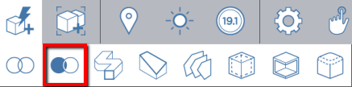
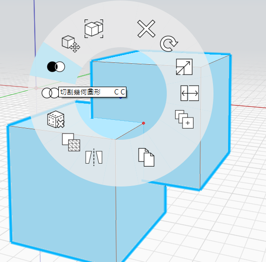

# Corte booleano

É possível cortar um objeto ou grupo de outro com a ferramenta Cortar. Existem duas maneiras de acessar a ferramenta Cortar:

## Executar o comando Cortar primeiro

Teclado: C G

Execute o comando Cortar e siga as instruções de modo no canto superior esquerdo da tela

Clique uma vez para selecionar um objeto para cortar:

Clique uma vez para selecionar objeto\(s\) ou grupo\(s\) a ser(em) removido(s):

Clique na marca de seleção para encerrar o comando. O objeto que foi removido permanece na cena. É possível excluí-lo ou usar [Camadas](layers.md) para ocultá-lo.

## Selecionar primeiro os objetos

1. Clique duas vezes para selecionar o objeto a ser cortado. \(Clique uma vez para um grupo\)
2. Mantendo pressionada a tecla **Ctrl**, clique duas vezes em um objeto sobreposto para cortar.
3. Clique com o botão direito do mouse no objeto que será cortado e escolha a [**ferramenta Cortar**](https://github.com/FormIt3D/autodesk-formit-360-windows-help/tree/c377e7b8a3b8e43e684321d0b7de867608d317a3/tool-library/boolean-operations.md) no menu de contexto. 

