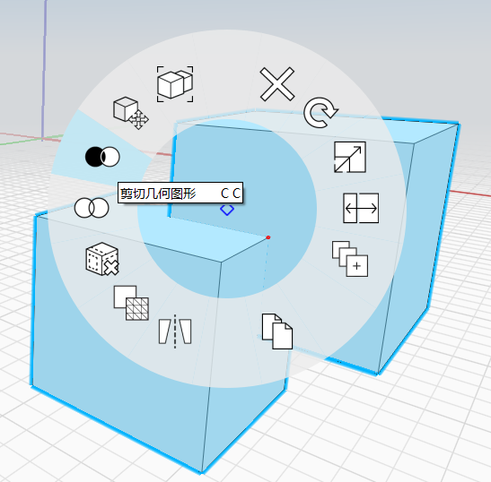

# 布林切割

您可以使用「切割工具」從一個物件或群組切割出另一個。有兩種方式可存取「切割」工具：

## 先執行「切割」指令

鍵盤：C G

執行「切割」指令，然後遵循螢幕左上角的模式指示

按一下以選取要切割的物件：

按一下以選取要移除的物件或群組：

按一下勾號以完成指令。 移除的物件會保留在場景中。您可以刪除它，或使用[圖層](layers.md)隱藏它。

## 先選取物件

1. 按兩下以選取要切割的物件。\(如果是群組則按一下\)
2. 按住 **Ctrl 鍵**並按兩下重疊物件即可切除。
3. 在要切割的物件上按一下右鍵，然後在關聯式功能表中選擇[**切割工具**](https://github.com/FormIt3D/autodesk-formit-360-windows-help/tree/c377e7b8a3b8e43e684321d0b7de867608d317a3/tool-library/boolean-operations.md)。

