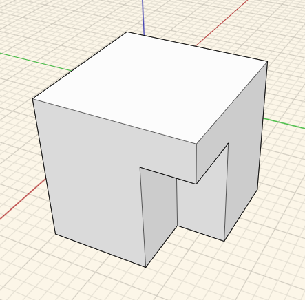

### Boolean Operations
---
> Use Join and Cut operations to alter objects.

---

#### Join
To perform a union, select all the objects you want to boolean. Then, select the **Join Tool** from the Context Menu. The intersecting/overlapping portion of the geometry will be united into one object. 

#### Cut 
To subtract volumes from existing geometry, first select the original object. Next select the object you want to subtract from it. Then select the **Cut Tool** from the Context Menu. The intersected volume will be subtracted from the original object.

