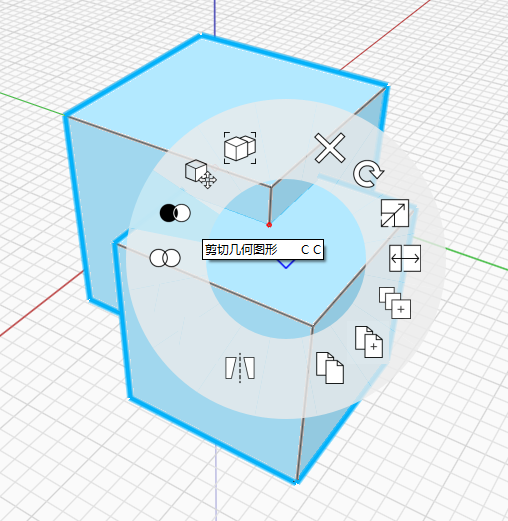

### 부울 연산
결합 및 잘라내기 작업을 사용하여 객체를 변경할 수 있습니다.

#### 결합
결합을 수행하려면 부울을 적용할 모든 객체를 선택합니다. 그런 다음, 상황에 맞는 메뉴에서 **결합 도구**를 선택합니다. 형상의 교차/겹치는 부분은 하나의 객체로 결합됩니다.

#### 잘라내기
기존 형상에서 볼륨을 빼려면 먼저 원래 객체를 선택합니다. 그러고 나서 뺄 객체를 선택합니다. 그런 다음, 상황에 맞는 메뉴에서 **잘라내기 도구**를 선택합니다. 교차된 볼륨이 원래 객체에서 제외됩니다.

