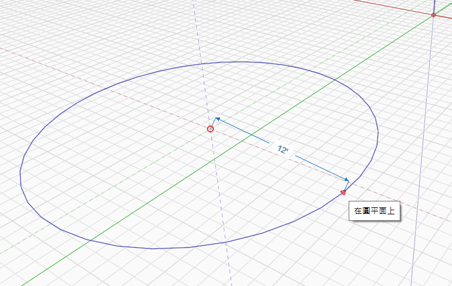
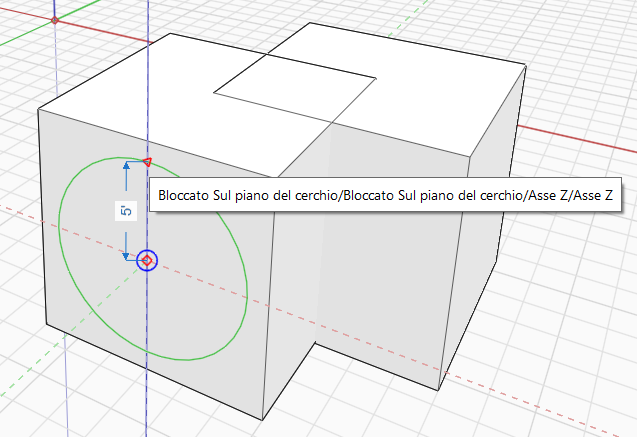

# Cercle

Utilisez l’outil Cercle pour dessiner un cercle dans l’espace ou sur un autre objet.

Clavier : C

Pour dessiner un cercle, sélectionnez d’abord·le point central, puis indiquez le rayon du cercle. Ensuite, le cercle devient automatiquement une face.

